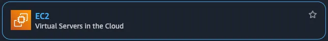

# AWS Cloudtrail 비활성화 탐지

&#x20;**\[ 목차 ]**

[#undefined](aws-cloudtrail.md#undefined "mention")

[#undefined-1](aws-cloudtrail.md#undefined-1 "mention")

[#undefined-2](aws-cloudtrail.md#undefined-2 "mention")

[#undefined-3](aws-cloudtrail.md#undefined-3 "mention")

[#undefined-4](aws-cloudtrail.md#undefined-4 "mention")

[#undefined-5](aws-cloudtrail.md#undefined-5 "mention")

[#id-1.-sns](aws-cloudtrail.md#id-1.-sns "mention")

[#id-2.-eventbridge](aws-cloudtrail.md#id-2.-eventbridge "mention")

[#id-3.-lambda-discord](aws-cloudtrail.md#id-3.-lambda-discord "mention")

[#id-4.-s3-cloudtrail](aws-cloudtrail.md#id-4.-s3-cloudtrail "mention")

[#id-5](aws-cloudtrail.md#id-5 "mention")

***

### **\[ 시나리오 안내 ]**

| 내용     | CloudTrail은 AWS 계정 내 활동을 기록하는 중요 서비스입니다. Cloudtrail을 중지하거나 삭제하려는 시도는 감사 회피 또는 악성 행위로 판단될 수 있습니다. 이 경우를 탐지하여 관리자에게 알리는 시나리오를 구현 해 봅니다. |
| ------ | ------------------------------------------------------------------------------------------------------------------------------------- |
| 사용 서비스 | CloudTrail, EventBridge, SNS                                                                                                          |
| 탐지 조건  | Cloudtrail을 중단, 삭제 등 이벤트를 모니터링 하도록 구성                                                                                                 |
| 알림 방식  | SNS + Email과 Lambda+Discord를 활용해 관리자에게 알림을 전송한다.                                                                                      |
| 대응     | 알림을 확인하고 사용자가 대처한다.                                                                                                                   |

***

### \[ 시나리오 전체적인 흐름 ]

<div align="left"><figure><figcaption></figcaption></figure></div>

| **AWS Service**                   | **Service Purpose**                                            | **Workbook Usage**                                                               |
| --------------------------------- | -------------------------------------------------------------- | -------------------------------------------------------------------------------- |
| CloudTrail                        | AWS 계정 내 모든 API 호출 및 리소스 변경 이벤트를 기록하는 감사·보안 모니터링 서비스           | 중단/삭제 등 감사 회피 시도를 실시간으로 감지하고, 모든 이벤트를 로그로 저장함                                    |
| S3                                | 인터넷을 통해 데이터를 안전하게 저장·관리하는 객체 스토리지 서비스                          | CloudTrail 작업 이벤트 로그의 저장소로 동작 (분석/쿼리 목적 아님, 단순 기록 보관용)                           |
| EventBridge                       | 다양한 AWS 서비스 및 사용자 지정 이벤트를 조건에 따라 규칙적으로 분기·전달하는 이벤트 라우팅 서비스     | CloudTrail에서 발생한 StopLogging, DeleteTrail 같은 이벤트를 탐지하여 하위 서비스(SNS/Lambda)로 즉시 전달 |
| SNS (Simple Notification Service) | 다양한 엔드포인트(Email, Lambda, SMS 등)로 메시지/알림을 발행·구독 형태로 전달하는 알림 서비스 | EventBridge로부터 감지된 이벤트를 이메일(관리자)와 Lambda 함수로 트리거 및 알림 전송                         |
| Lambda                            | 서버리스 환경에서 다양한 이벤트 소스(SNS 등)로 코드를 실행할 수 있는 컴퓨팅 서비스              | SNS에서 전달받은 경보성 CloudTrail 이벤트를 실시간으로 받아, Discord Webhook API로 관리자 채널에 메시지 자동 전송  |
| Discord (외부)                      | 메신저 기반의 협업 채널로 알림을 실시간 확인할 수 있는 외부 알림 플랫폼                      | Lambda의 Webhook 연동으로 보안경보 메시지를 운영자 Discord 채널에 전송하여 빠른 대응 가능                     |

#### 실습 개요

* 이 워크북에서는 AWS CloudTrail이 비활성화되거나 조작되는 이벤트를 실시간으로 모니터링하고 탐지하는 방법을 학습합니다.
* CloudTrail은 AWS 계정에서 발생하는 API 활동을 기록하는 핵심 서비스로, 보안 감사, 규정 준수, 사고 대응에 필수적입니다. 따라서 악의적인 사용자가 CloudTrail을 중단하거나 삭제하려는 시도는 심각한 보안 위협으로 간주됩니다.
* 본 실습에서는 EventBridge, SNS, Lambda, Discord 알림 연동을 통해 CloudTrail 관련 주요 이벤트를 탐지하고, 사용자에게 실시간 알림이 전달되도록 구성합니다.

#### 학습 목표

* CloudTrail에서 발생하는 다음 주요 이벤트를 탐지하도록 EventBridge 규칙을 구성하는 방법을 학습합니다:
  * `StopLogging`: 로깅 중단 시도
  * `DeleteTrail`: 트레일 삭제 시도
  * `UpdateTrail`: 트레일 구성 변경 시도
  * `PutEventSelectors`: 이벤트 선택기 설정 변경 시도
* EventBridge를 통해 탐지된 이벤트를 SNS로 전송하고, 이를 기반으로 이메일 및 Discord로 알림을 수신하는 과정을 실습합니다.
* Lambda 함수를 이용해 SNS 이벤트 데이터를 파싱하고, 디스코드 웹훅에 메시지를 전송하는 자동화 방법을 학습합니다.
* 실습을 통해 감사 로그를 조작하려는 시도에 대해 사전에 대응할 수 있는 탐지 및 경고 체계를 구성할 수 있습니다.

***

#### 참고 사항

* 본 시나리오는 어느 리전이든 구현 가능하지만, 모든 서비스의 리전은 동일하게 구현하여야 합니다.
* 리소스명은 해당 시나리오에 맞게 임의로 설정하였으며 사용자가 원하는 이름으로 바꿔도 무방합니다.


**\[ 콘솔 리소스명 ]**

| **리소스 종류**       | **리소스명 설정**                   | **목적**                                      |
| ---------------- | ----------------------------- | ------------------------------------------- |
| S3 Bucket        | **`s3-cloudtrail-monitor`**   | CloudTrail 로그 저장용 버킷                        |
| SNS Topic        | **`sns-cloudtrail-alarm`**    | 이벤트 발생 시 이메일 및 Lambda로 알림을 전송하는 주제          |
| Lambda Function  | **`lambda-ct-detect-alarm`**  | SNS 메시지를 파싱하여 Discord Webhook으로 이상 행위 알림 전송 |
| EventBridge Rule | **`eventbridge-ct-detect`**   | 특정 CloudTrail 이벤트 발생 시 SNS로 이벤트 전송하는 트리거 역할 |
| CloudTrail Trail | **`ct-trail-monitor`**        | AWS 계정 내 API 활동을 감시하고 로그를 S3로 저장            |
| Discord 채널       | **`cloudtrail_detect_alarm`** | CloudTrail 알림 메시지를 수신하고 확인할 수 있는 알림 채널      |

***

### **\[ 시나리오 상세 구현 과정 ]**

<details>

<summary><strong>1. SNS 주제 생성 및 구독 설정</strong></summary>

**STEP 1) SNS 검색**

<figure><figcaption></figcaption></figure>

알람을 전송 받을 주제 및 구독을 생성하기 위해 **SNS 서비스**로 이동한다.


**STEP 2) 주제 생성**

<figure><figcaption></figcaption></figure>

좌측 탭에서 Topic으로 이동 후 **Create** topic 버튼을 클릭한다.


<figure><figcaption></figcaption></figure>

* **Type** : Standard
* **Name** : `sns-cloudtrail-alarm` \</aside>


**STEP 3 ) 구독 생성**

<figure><figcaption></figcaption></figure>

생성된 주제 확인 후 **Create subscription**을 누른다.


**\[ 구독 생성 - 세부사항 ]**

<figure><figcaption></figcaption></figure>

* **Protocol** : email
* **Endpoint** : 알람 받을 이메일 주소


**STEP 4 ) 구독한 이메일 인증**

<figure><figcaption></figcaption></figure>

설정한 이메일 주소로 SNS의 Subscription Confirmation 메일이 전송된다. 이메일을 열어 **Confirm subscription** 버튼을 클릭하여 인증해야 알림 수신이 정상적으로 설정된다.


<figure><figcaption></figcaption></figure>

**Confirm subscription**를 눌러 인증을 완료하면, SNS 구독이 정상적으로 등록된 것이다.


</details>

<details>

<summary>2. EventBridge 규칙 생성</summary>

**STEP 1) EventBridge 검색**

<figure><figcaption></figcaption></figure>

Lambda 함수를 주기적으로 실행하기 위해 AWS 콘솔에서 **EventBridge 서비스**로 이동한다.


**STEP 2) EventBridge 생성**

<figure><figcaption></figcaption></figure>

**EventBridge** 서비스 화면 오른쪽 상단의 **EventBridge Rule**을 선택하고 **Create rule**버튼을 클릭한다.


**\[ 상세 규칙 설정 ]**

<figure><figcaption></figcaption></figure>

규칙 이름, 설명, EventBus 종류, 규칙 유형(이벤트 패턴 기반 or 스케줄 기반) 설정 후 **Next버튼**을 클릭한다.

* **Name** : `eventbridge-ct-detect`
* **Event bus :** default
* **Rule type** : Rule with an event pattern


**\[ 이벤트 패턴 작성 ]**

<div align="left"><figure><figcaption></figcaption></figure></div>

탐지할 이벤트 조건을 설정을 설정하고 **Next**버튼을 클릭한다.

**Events :** Other

**Event pattern** : Custom pattern (JSON editor)

```json
{
  "source": ["aws.cloudtrail"],
  "detail-type": ["AWS API Call via CloudTrail"],
  "detail": {
    "eventSource": ["cloudtrail.amazonaws.com"],
    "eventName": [
      "StopLogging",
      "DeleteTrail",
      "UpdateTrail",
      "PutEventSelectors"
    ]
  }
}
```


**\[ 설정한 이벤트 안내 ]**

| **이벤트 이름**          | **설명**                                 | **탐지 목적**                                    |
| ------------------- | -------------------------------------- | -------------------------------------------- |
| `StopLogging`       | CloudTrail 로그 수집 중지                    | **감사 회피 시도 탐지** – 로그를 남기지 않으려는 행위 식별         |
| `DeleteTrail`       | 기존 CloudTrail 추적 삭제                    | **감사 기능 제거 시도** – 추적 자체를 없애려는 공격 식별          |
| `UpdateTrail`       | CloudTrail의 S3 대상, 로그 옵션 등 설정 변경       | **로깅 대상 변경 시도 탐지** – 공격자가 다른 S3로 로그 보내는 경우 등 |
| `PutEventSelectors` | 추적할 이벤트 종류(Management/Insight 등) 설정 변경 | **이벤트 필터 조작 탐지** – 중요한 이벤트 제외 시도 식별          |


**\[ 대상 선택 ]**

<figure><figcaption></figcaption></figure>

이벤트가 감지되었을 때 실행할 대상 지정하고 **Next**버튼을 클릭한다.

* **Target types:** AWS service
* **Select a target:** SNS topic
* **Target location:** Target in this account
* **Topic:** 앞서 생성한 sns topic 선택 \</aside>


**\[ 태그 구성 (선택) ]**

<figure><figcaption></figcaption></figure>

태그 구성은 선택 사항이므로 **Next**버튼을 클릭한다.


**\[ 검토 및 생성 ]**

<figure><figcaption></figcaption></figure>

설정 내용 최종 확인 후 **Create rule**버튼을 클릭한다.

* status - **enabled** 확인&#x20;


**STEP 3) 생성된 규칙 확인**

<figure><figcaption></figcaption></figure>

규칙이 정상적으로 생성되었는지 확인해준다.


</details>

<details>

<summary>3. Lambda 함수 생성 및 Discord 연동</summary>

**STEP 1) Discord 채널 생성 및 WebHook 설정**

**\[ 채널 만들기 ]**

<div align="left"><figure><figcaption></figcaption></figure></div>

이벤트에 관한 알림을 수신 할 채널을 만들어준다.

* **채널 이름** : `cloudtrail_detect_alarm`&#x20;


**\[ 채널 편집 ]**

<div align="left"><figure><figcaption></figcaption></figure></div>

위와 같이 생성된 채널에서 **채널 편집**을 클릭한다.


**\[ 웹후크 연동 ]**

<figure><figcaption></figcaption></figure>

왼쪽 상단의 설정 목록에서 **연동 → 웹후크 만들기**를 클릭하여 웹후크 봇을 만들어 준다.


**\[ 웹후크 URL 복사 ]**

<figure><figcaption></figcaption></figure>

**웹후크 URL 복사** 버튼을 클릭해 Lambda에서 사용할 URL을 복사한다.

* **이름** : WEBHOOK\_URL
* **채널** : `#cloudtrail_detect_alarm` (앞서 생성한 채널 이름 선택)


**STEP 2) Lambda 함수 생성**

<figure><figcaption></figcaption></figure>

알람을 발송할 함수를 만들기 위해 AWS 콘솔에서 **Lambda서비스**로 이동한다.


<figure><figcaption></figcaption></figure>

Lambda 서비스 화면 오른쪽 상단의 **Create a function** 버튼을 클릭한다.


**\[ 함수 생성 ]**

<figure><figcaption></figcaption></figure>

함수 이름, 런타임 및 아키텍처를 지정하고 **Create function**버튼을 클릭한다.

* **Author from scratch** 선택
* **Function name** : `lambda-ct-detect-alarm`
* **Runtime** : Python 3.13
* **Architecture** : x86\_64


**\[ 생성된 함수 확인 ]**

<figure><figcaption></figcaption></figure>

정상적으로 Lambda함수가 생성되었는지 확인해준다.


**STEP 3) 환경 변수 편집**

<figure><figcaption></figcaption></figure>

이후 Configuration → Environment variables로 들어가서 **Edit** 버튼을 클릭한다.


**\[ 환경 변수 추가 ]**

<figure><figcaption></figcaption></figure>

Edit environment variables로 이동하여 **Add environment variables** 버튼을 클릭한다.


**\[ 환경 변수에 키와 값 추가 ]**

<figure><figcaption></figcaption></figure>

**Key, Value**를 다음과 같이 추가한 이후 **Save**버튼을 눌러 환경 변수를 추가해 준다.

* **Key, Value는 표를 참고**

| Key                   | **용도/설명**            | Value                                                                                           |
| --------------------- | -------------------- | ----------------------------------------------------------------------------------------------- |
| DISCORD\_WEBHOOK\_URL | 디스코드 알림용 Webhook URL | [https://discord.com/api/webhooks/\~\~\~](https://discord.com/api/webhooks/~~~) (알림 받을 웹후크 url) |


**STEP 4) Lambda 코드 소스 편집**

<figure><figcaption></figcaption></figure>

Code탭에서 **Lambda python 코드**를 작성 후 **Deploy**버튼을 클릭하여 배포해 준다.

```python
import json
import urllib.request
import os
from datetime import datetime, timezone, timedelta

def lambda_handler(event, context):
    # 환경변수에서 Discord 웹훅 URL 가져오기
    webhook_url = os.environ.get('DISCORD_WEBHOOK_URL')
    if not webhook_url:
        print("환경변수 DISCORD_WEBHOOK_URL이 설정되어 있지 않습니다.")
        return {'statusCode': 500, 'body': 'Webhook URL not set'}

    try:
        # SNS 메시지 추출 및 파싱
        sns_message_str = event['Records'][0]['Sns']['Message']
        sns_message = json.loads(sns_message_str)

        # 이벤트 상세 정보 추출
        detail = sns_message.get("detail", {})
        event_name = detail.get("eventName", "Unknown Event")
        event_time_utc = detail.get("eventTime")
        user_identity = detail.get("userIdentity", {})
        user_arn = user_identity.get("arn", "Unknown ARN")
        source_ip = detail.get("sourceIPAddress", "Unknown IP")
        aws_region = detail.get("awsRegion", "Unknown Region")
        account_id = detail.get("recipientAccountId", "Unknown Account")

        # UTC 시간을 한국 시간(KST)으로 변환
        if event_time_utc:
            try:
                utc_dt = datetime.strptime(event_time_utc, "%Y-%m-%dT%H:%M:%SZ").replace(tzinfo=timezone.utc)
                kst_dt = utc_dt.astimezone(timezone(timedelta(hours=9)))
                event_time_kst = kst_dt.strftime("%Y-%m-%d %H:%M:%S (KST)")
            except Exception as e:
                print("시간 변환 실패:", e)
                event_time_kst = event_time_utc + " (UTC)"
        else:
            event_time_kst = "Unknown Time"

    except Exception as e:
        # 메시지 파싱 실패 시 기본 값 설정
        print("SNS 메시지 파싱 실패:", e)
        event_name = "Unknown Event"
        event_time_kst = "Unknown Time"
        user_arn = "Unknown ARN"
        source_ip = "Unknown IP"
        aws_region = "Unknown Region"
        account_id = "Unknown Account"

    # Discord로 전송할 메시지 구성
    content = (
        f"**[ CloudTrail 이벤트 탐지 ]**\\n"
        f"• 이벤트 이름: `{event_name}`\\n"
        f"• 발생 시간: `{event_time_kst}`\\n"
        f"• 사용자 ARN: `{user_arn}`\\n"
        f"• 소스 IP: `{source_ip}`\\n"
        f"• 리전: `{aws_region}`\\n"
        f"• 계정 ID: `{account_id}`"
    )

    payload = json.dumps({"content": content}).encode("utf-8")

    # Discord 웹훅 요청 생성 및 전송
    req = urllib.request.Request(
        webhook_url,
        data=payload,
        headers={
            "Content-Type": "application/json",
            "User-Agent": "Mozilla/5.0 (Lambda)"
        }
    )

    try:
        with urllib.request.urlopen(req) as response:
            resp_body = response.read()
            print("Discord 응답:", resp_body)
    except Exception as e:
        # 전송 실패 시 오류 출력
        print("Discord 전송 실패:", e)
        return {'statusCode': 500, 'body': 'Discord notification failed'}

    return {'statusCode': 200, 'body': 'Notification sent successfully'}

```

**STEP 5) Lambda 트리거 추가**

**\[ Lambda 트리거 - SNS ]**

<figure><figcaption></figcaption></figure>

생성한 Lambda함수의 다이어그램 왼쪽 하단의 **Add trigger**버튼을 클릭한다.


**STEP 5-1) Lambda 트리거 - SNS 추가**

<figure><figcaption></figcaption></figure>

트리거 구성, sns 주제를 지정하고 **Add**버튼을 클릭한다.

* **Trigger configuration** : SNS
* **SNS topic** : 앞서 생성한 SNS 주제 선택


**STEP 6) 추가된 트리거 확인**

<figure><figcaption></figcaption></figure>

SNS가 정상적으로 트리거링 되었고 Discord에 알림을 보내기 위한 설정을 마쳤다.

</details>

<details>

<summary>4. S3 버킷 및 CloudTrail 추적 생성</summary>

**STEP 1) S3 검색**

<figure><figcaption></figcaption></figure>

언제든지 내 데이터를 안전하고 확장 가능하게 저장하고 접근하기 위해 AWS 콘솔에서 **S3 서비스로 이동**한다.


**STEP 2) S3 bucket 생성**

\[ **S3 bucket 생성 ]**

<figure><figcaption></figcaption></figure>

**S3** 서비스 화면 오른쪽 상단의 **Create a bucket**버튼을 클릭한다.


**\[ bucket 속성 선택 ]**

<figure><figcaption></figcaption></figure>

<figure><figcaption></figcaption></figure>

<figure><figcaption></figcaption></figure>

* **Bucket name :** **`s3-cloudtrail-monitor`**
* **Object Ownership :** ACLs disabled (recommended)
* **Block Public Access settings for this bucket :** Block all public access
* **Bucket Versioning :** Enable
* **Encryption type :** Server-side encryption with Amazon S3 managed keys (SSE-S3)&#x20;


**STEP 3) CloudTrail 검색**

<figure><figcaption></figcaption></figure>

AWS 계정 내에서 발생하는 API 호출 및 활동 내역을 자동으로 기록하고 추적하기 위해 **CloudTrail서비스**로 이동한다.


**STEP 4) CloudTrail 생성**

<figure><figcaption></figcaption></figure>

**Create trail** 버튼을 클릭해 사용할 추적을 생성한다.


**\[ 추적 속성 선택 ]**

<figure><figcaption></figcaption></figure>

CloudTrail 트레일(추적)의 기본 설정을 지정 후 **Next**버튼을 클릭한다.

* **Trail name** : **`ct-trail-monitor`**
* **Storage location :** Use existing S3 bucket (**Browe**를 클릭해 앞서 생성한 버킷 선택)
* **Additional settings**
  * **Log file validation :** Enabled \</aside>


**\[ 로그 이벤트 선택 ]**

<div align="left"><figure><figcaption></figcaption></figure></div>

로그 이벤트, 이벤트 관리 옵션 선택 후 **Next**버튼을 클릭한다.

* **Events** : Management events, Insights events
* **Management events - API activity :** Read, Write


**\[** **검토 및 생성 ]**

<figure><figcaption></figcaption></figure>

각 단계 검토 후 **Create trail** 버튼을 클릭하면 추적이 생성된다.


**STEP 3) 추적 생성 확인**

<figure><figcaption></figcaption></figure>

<figure><figcaption></figcaption></figure>

대시보드에서 정상적으로 추적이 생성되었는지 확인한다.

</details>

<details>

<summary>5. 테스트</summary>

> CloudTrail에서 기존에 만든 추적 화면에서 이벤트 조작 시도 후 알림 확인 단계


**\[ 탐지 이벤트 안내 ]**

| **이벤트 이름**          | **설명**                                 | **탐지 목적**                                    |
| ------------------- | -------------------------------------- | -------------------------------------------- |
| `StopLogging`       | CloudTrail 로그 수집 중지                    | **감사 회피 시도 탐지** – 로그를 남기지 않으려는 행위 식별         |
| `DeleteTrail`       | 기존 CloudTrail 추적 삭제                    | **감사 기능 제거 시도** – 추적 자체를 없애려는 공격 식별          |
| `UpdateTrail`       | CloudTrail의 S3 대상, 로그 옵션 등 설정 변경       | **로깅 대상 변경 시도 탐지** – 공격자가 다른 S3로 로그 보내는 경우 등 |
| `PutEventSelectors` | 추적할 이벤트 종류(Management/Insight 등) 설정 변경 | **이벤트 필터 조작 탐지** – 중요한 이벤트 제외 시도 식별          |


**\[ `StopLogging` 이벤트 발생 ]**

<figure><figcaption></figcaption></figure>

CloudTrail 콘솔에서 해당 Trail의 **Logging 상태**를 확인 후 **Stop logging** 버튼을 클릭하여 로깅을 중지한다.


<figure><figcaption></figcaption></figure>

추적 로깅이 정상적으로 중지되었는지 확인한다.

이때 `StopLogging` 이벤트가 CloudTrail 로그에 기록된다.


**\[ `DeleteTrail`이벤트 발생 ]**

<figure><figcaption></figcaption></figure>

로깅 상태와 관계없이 삭제할 수 있고 **Delete** 버튼을 클릭하면 된다.

정상적으로 삭제가 되면 `DeleteTrail` 이벤트가 발생한다.


**\[ `UpdateTrail`이벤트 발생 ]**

<figure><figcaption></figcaption></figure>

대상 Trail 오른쪽에서 **Edit** 버튼을 클릭하여 편집 화면으로 이동한다.


<figure><figcaption></figcaption></figure>

S3 로그 버킷 위치, CloudWatch Logs 그룹, SNS 등 설정을 원하는 대로 수정하고 **Save changes**를 클릭하여 적용하면 된다.

추적 설정이 수정되면 `UpdateTrail` 이벤트가 기록된다.


**\[ `PutEventSelectors`이벤트 발생 ]**

<figure><figcaption></figcaption></figure>

Trail 설정에서 **Management events** 항목의 **Edit** 버튼을 클릭한다.


<figure><figcaption></figcaption></figure>

`KMS events` 항목을 선택/해제하는 등 **API activity** 항목 중 하나를 수정한다. 이 중 하나만 수정해도 `PutEventSelectors` 이벤트 발생한다.

여러 항목 중 임의로 **Exclude KMS events**를 변경하였고 **Save changes**버튼을 클릭하여 적용하면 된다.

이벤트 선택 조건이 변경되면 **`PutEventSelectors`**&#xC774;벤트가 발생한다.

***

**\[ Email 알림 확인 ]**

<div align="left"><figure><figcaption></figcaption></figure></div>


**\[ Discord 알림 확인 ]**

<div align="left"><figure><figcaption></figcaption></figure></div>

</details>
