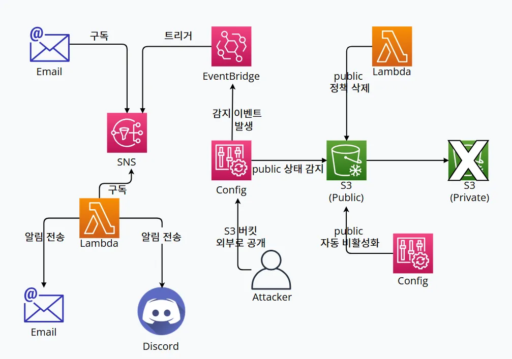

# S3 퍼블릭 버킷 생성 탐지 및 알람

***

**\[ 목차 ]**

[#undefined](./#undefined "mention")

[#undefined-1](./#undefined-1 "mention")

[#undefined-2](./#undefined-2 "mention")

[#undefined-3](./#undefined-3 "mention")

[#id-1.-aws-config](./#id-1.-aws-config "mention")

[#id-2.-sns](./#id-2.-sns "mention")

[#id-3.-eventbridge](./#id-3.-eventbridge "mention")

[#id-4.-lambda-discord](./#id-4.-lambda-discord "mention")

[#id-5](./#id-5 "mention")

[#id-6.-public](./#id-6.-public "mention")

***

#### \[ 시나리오 안내 ]

<table data-header-hidden><thead><tr><th width="137.5"></th><th></th></tr></thead><tbody><tr><td>내용</td><td>S3 버킷은 정적 웹 서비스 용도로 사용하는것 외에는 업무 목적이나 민감정보가 포함될 수 있어 관리가 필요하다.
<br>이에 S3 버킷이 외부로 공개(Public) 되었을 경우 탐지하는 정책을 구현해 본다.</td></tr><tr><td>사용 서비스</td><td>AWS Config, SNS, Cloudwatch</td></tr><tr><td>탐지 조건</td><td>Config ruleset 정책 중 S3 데이터가 외부에서 연결될 수 있는지 검토하는 룰을 활용</td></tr><tr><td>알림 방식</td><td>SNS + Email 또는 SNS + Lambda를 활용해 DIscord으로 전송한다. </td></tr><tr><td>대응</td><td>Config ruleset 정책을 위반한 경우 버킷의 퍼블릭 정책을 비활성화 한다.</td></tr></tbody></table>

#### 실습 개요

* 이 워크북에서는 Amazon S3 버킷이 공개(Public) 접근 설정이 되었을 때 이를 모니터링하고 탐지하는 방법을 학습합니다.
* S3는 정적 웹 호스팅 용도, 데이터 저장 및 관리 등의 용도로 자주 사용됩니다. 하지만 버킷 내부에는 중요한 비즈니스 데이터 뿐만 아니라 사용자, 고객, 기업의 민감 정보가 포함될 수 있어 철저한 접근 관리가 필요합니다.
* 본 워크북에서는 AWS Config 규칙과 SNS 알림을 활용하여 버킷 ACL 또는 정책이 공개 접근(Public Access)을 허용하는 경우 즉시 알림을 받도록 설정하는 구성을 실습합니다.

#### 학습 목표

* AWS Config을 활성화 하고 S3 버킷 공개 접근 감사를 설정하는 방법을 학습합니다.
* 실습을 통해 퍼블릭 엑세스를 허용하는 버킷 ACL과 버킷 정책의 차이를 이해할 수 있습니다.
* AWS Config의 관리형 규칙 또는 사용자 정의 규칙을 생성하고 구성할 수 있습니다.
* 퍼블릭 노출 버킷에 대한 알림을 수신하기 위해 Amazon SNS 토픽 생성 및 구독을 이해할 수 있습니다.
* 실제 버킷을 생성하고 정책을 변경하여 구성한 탐지 정책이 동작하는지 검증하는 과정을 학습합니다.

***

#### \[ 시나리오 전체적인 흐름 ]

<figure><figcaption></figcaption></figure>

<table data-header-hidden><thead><tr><th width="155"></th><th></th><th></th></tr></thead><tbody><tr><td><strong>AWS Service</strong></td><td><strong>Service Purpose</strong></td><td><strong>Workbook Usage</strong></td></tr><tr><td>S3</td><td>Simple Storage Service의 약자로 확장성, 데이터 가용성, 보안 및 성능을 제공하는 객체 스토리지 서비스 입니다.S3를 활용하여 객체(object) 스토리지 서비스로 이밎, 로그, 백업 등 비정형데이터를 저장할 수 있으며, 정적 웹 호스팅, 버전 관리, 수명 주기 관리등의 기능을 활용할 수 있습니다.</td><td>S3를 생성하고 퍼블릭 상태로 정책을 변경하는 대상으로 사용되며, 필요시 조치를 진행합니다.</td></tr><tr><td>Config</td><td>AWS 리소스의 변경/설정 이력을 기록하고 평가하는 AWS 관리형 서비스 입니다.사전 정의 규칙이나 사용자 정의 규칙을 이용하여 변경 발생 시점에 대한 상세한 감사 로그를 제공합니다.</td><td>S3의 퍼블릭 접근 정책이 설정되면 AWS Config을 사용하여 변경 이력을 탐지합니다.s3-bucket-public-read-prohibited와 같은 사전 정의 규칙이나 사용자 정의 규칙을 이용하여 비준수(Non-compliant) 상태를 검토합니다.</td></tr><tr><td>EventBridge</td><td>AWS 서비스 및 애플리케이션에서 사용자가 정의한 이벤트가 발생하는 경우 다양한 대상 서비스(Lambda, SNS 등)로 전달하는 서비스 입니다.복잡한 이벤트 버스를 구현하거나 스케쥴링 기능으로도 활용할 수 있습니다.</td><td>Config에서 설정한 규칙의 비준수(Non-compliant)상태를 확인하는 경우 이 내용을 SNS와 Lambda로 전달합니다.</td></tr><tr><td>SNS</td><td>발행-구독 기반의 메시징 서비스 입니다.이벤트를 HTTP, HTTPS, Email, SMS, Lambda, SQS 등 다양한 엔드포인트로 전달할 수 있습니다.</td><td>Eventbridge로 부터 수신한 이벤트 이력을 확인하고 SNS 주제를 구독하고 있는 이메일로 이벤트 이력을 전송합니다.</td></tr><tr><td>Lambda</td><td>서버를 프로비저닝하거나 관리할 필요 없이 코드를 실행할 수 있는 서버리스 컴퓨팅 서비스입니다.다양한 이벤트 소스(S3, Eventbridge, SNS 등)와 연동하여 이벤트에 대한 응답으로 코드를 실행할 수 있습니다.</td><td>Eventbridge로 부터 수신한 이벤트 이력을 확인하여 외부 메신저로 전송하기 위한 데이터 포멧을 정의합니다.전달에 필요한 메시지를 검토하고 사전 지정한 외부 Webhook(Slack, Discord 등)으로 전달합니다.또한 S3의 퍼블릭 접근 정책을 비활성화 하기 위해 “pub-bucket-policy” 혹은 “<code>put-bucket-policy</code> 혹은 <code>put-public-access-block</code> API 를 활용해 정책을 변경합니다.</td></tr></tbody></table>

***

#### 참고 사항

* 해당 시나리오의 경우, 본 프로젝트의 계정에서 IAM으로는 실행 불가능합니다. **IAM 권한으로 aws config 규칙 삭제가 불가능 하기** 때문에, 실습 진행 시 자신의 ROOT 계정으로 진행해야 합니다.
* 본 서비스의 주요 리소스는 “ap-northeast-2(Seoul)”에서 리전에서 진행됩니다. 주요 서비스 및 기능은 제공되는 서비스 리전에 따라 다를 수 있습니다.
* 해당 시나리오에 맞게 리소스명은 임의로 설정하였으며 사용자가 원하는 이름으로 바꿔도 무방합니다.


**\[콘솔 리소스명]**

| 리소스 종류               | 리소스명 설정                         | 목적                                |
| -------------------- | ------------------------------- | --------------------------------- |
| **S3 Bucket**        | **`s3-config-logbucket`**       | AWS Config 로그 저장용 버킷              |
| **AWS Config Role**  | **`iam-config-role`**           | Config 서비스 실행 권한 역할               |
| **SNS Topic**        | **`sns-config-alert`**          | 퍼블릭 탐지 시 이메일 알림 SNS 토픽            |
| **Lambda 함수**        | **`lambda-config-function`**    | Config 이벤트 감지 후 Discord 알림 Lambda |
| **Lambda Role**      | **`iam-lambda-config`**         | Lambda 실행용 역할                     |
| **EventBridge Rule** | **`eventbridge-config-public`** | 퍼블릭 상태 감지 시 Lambda/SNS 실행 규칙      |
| **Lambda Policy**    | **`lambda-public-block`**       | 퍼블릭 상태 감지 시 S3 버킷을 자동으로 비공개 처리    |

***

### **\[ 시나리오 상세 구현 과정 ]**

<details>

<summary>1. AWS Config 규칙 생성</summary>

**STEP 1) Config 검색**

<figure><figcaption></figcaption></figure>

S3 퍼블릭 설정을 탐지하는 규칙을 생성하기 위해 Config로 이동한다.


**\[Configuration Recoder 설정 확인]**

<figure><figcaption></figcaption></figure>

고객 관리형 레코드의 경우, Config 규칙은 고객이 직접 설정한 레코더를 전제로 작동하기 때문에 고객 관리형 레코드 기록이 활성화되어 있어야 한다.


<div align="left"><figure><figcaption></figcaption></figure></div>

<div align="left"><figure><figcaption></figcaption></figure></div>

만일 레코드가 설정되어 있지 않다면 위와 같이 설정하면 된다.

재정의 설정 경우, 해당 리소스 유형은 탐지에서 제거되기 때문에 정의를 하지 않는 것이 좋다.


**STEP 2) 전송 채널 설정**

<figure><figcaption></figcaption></figure>

* **Data retention period:** Retain AWS Config data for 7 years(2557 days)
* **Amazon S3 bucket:** Create a bucket
* **S3 Bucket name:** **`s3-config-logbucket`**

해당 항목을 지정하고 **Save**버튼을 클릭한다.


**STEP 3 ) Config 규칙 추가**

<figure><figcaption></figcaption></figure>

AWS Config > Rules > Add rules를 클릭한다.


<figure><figcaption></figcaption></figure>

* **Select rule type:** Add AWS managed rule
* **`s3-bucket-public-read-prohibited`** 필터링 후 Next 클릭한다.&#x20;


<figure><figcaption></figcaption></figure>

<figure><figcaption></figcaption></figure>

* **Scope of changes** : Resources
* **Resource category** : All resource categories
* **Resource type:** Multiple selected
* **Frequency:** 24 hours&#x20;


<figure><figcaption></figcaption></figure>

**`s3-bucket-public-write-prohibited`** 도 동일한 방식으로 진행하며 다음과 같이 규칙이 생성된 결과를 볼 수 있다. 실습이 끝난 후에는 평가당 $0.001 청구되므로 빈도는 최소화하고 필요 없는 규칙은 삭제하는 것이 좋다.

<table><thead><tr><th width="167.640625">규칙 이름</th><th>개념</th></tr></thead><tbody><tr><td><code>s3-bucket-public-read-prohibited</code></td><td>S3 버킷이 <strong>인터넷에 공개적으로 읽기 가능</strong>한 상태인지 감지하는 AWS Config 규칙이다.<br>즉, 누구나 객체를 다운로드할 수 있는 상태를 비준수(위험)로 판단한다.</td></tr><tr><td><code>s3-bucket-public-write-prohibited</code></td><td>S3 버킷이 <strong>인터넷에 공개적으로 쓰기 가능</strong>한 상태인지 감지하는 규칙이다.<br>즉, 누구나 객체를 업로드하거나 덮어쓸 수 있는 상태를 <strong>비정상으로 간주한다.</strong></td></tr></tbody></table>

</details>

<details>

<summary>2. SNS 주제 생성 및 구독 설정</summary>

**STEP 1) SNS 검색**

<figure><figcaption></figcaption></figure>

알람을 전송 받을 주제 및 구독을 생성하기 위해 AWS 콘솔에서 **SNS 서비스**로 이동한다.


**STEP 2) 주제 생성**

<figure><figcaption></figcaption></figure>

좌측 탭에서 Topic으로 이동 후 **Create topic** 버튼을 클릭한다.

<figure><figcaption></figcaption></figure>

* **Type** : Standard
* **Name** : **`sns-config-alert`**&#x20;


**STEP 3 ) 구독 생성**

<figure><figcaption></figcaption></figure>

생성된 주제 확인 후 **Create subscription**을 누른다.


**\[ 구독 생성 - 세부사항 ]**

<figure><figcaption></figcaption></figure>

* **Protocol** : Email
* **Endpoint** : 알람 받을 이메일 주소


**STEP 4 ) 구독한 이메일 인증**

<figure><figcaption></figcaption></figure>

알림 수신을 설정한 Email에 Subscription Confirmation 메일을 전송 받고 \*\*\*\*생성된 구독 확인 후 메일 인증을 해야 한다.

<figure><figcaption></figcaption></figure>

**Confirm subscription**를 눌러 인증을 완료하면, SNS 구독이 정상적으로 등록된 것이다.

</details>

<details>

<summary>3. EventBridge 규칙 생성</summary>

**STEP 1) EventBridge 검색**

<figure><figcaption></figcaption></figure>

AWS 서비스들이 발생시키는 이벤트를 감지하고, 조건에 따라 자동으로 후속 작업을 실행할 수 있도록 연결해주기 위해 AWS 콘솔에서 **EventBridge 서비스**로 이동한다.


**STEP 2) EventBridge 생성**

<figure><figcaption></figcaption></figure>

**Create rule** 버튼을 클릭해서 새 EventBridge 규칙을 생성한다.


**\[ 규칙 세부 정보 정의 ]**

<figure><figcaption></figcaption></figure>

* **Name** : **`eventbridge-config-public`**
* **Description**: (옵션)
* **Event bus :** default
* **Rule type** : Rule with an event pattern

규칙 이름, 설명, EventBus 종류, 규칙 유형(이벤트 패턴 기반 or 스케줄 기반) 설정 후 **Next버튼**을 클릭한다.


**\[ 이벤트 패턴 작성 ]**

<figure><figcaption></figcaption></figure>

<figure><figcaption></figcaption></figure>

* **Events :** Other
*   **Event pattern** : Custom pattern (JSON editor)

    사용자가 원하는 조건만 감지할 수 있도록 JSON으로 직접 작성
*   새 평가 결과가 **비준수(NON\_COMPLIANT)** 일 때 **이벤트를 탐지**하는 역할 JSON 코드

    ```json
    {
      "source": ["aws.config"],
      "detail-type": ["Config Rules Compliance Change"],
      "detail": {
        "configRuleName": [
          "s3-bucket-public-read-prohibited",
          "s3-bucket-public-write-prohibited"
        ],
        "newEvaluationResult": {
          "complianceType": ["NON_COMPLIANT"]
        }
      }
    }
    ```


**\[ 설정 규칙 안내]**

| 규칙 이름                               | 개념                                                                                                                              |
| ----------------------------------- | ------------------------------------------------------------------------------------------------------------------------------- |
| `s3-bucket-public-read-prohibited`  | <p>S3 버킷이 <strong>인터넷에 공개적으로 읽기 가능</strong>한 상태인지 감지하는 AWS Config 규칙이다.<br>즉, 누구나 객체를 다운로드할 수 있는 상태를 비준수(위험)로 판단한다.</p>         |
| `s3-bucket-public-write-prohibited` | <p>S3 버킷이 <strong>인터넷에 공개적으로 쓰기 가능</strong>한 상태인지 감지하는 규칙이다.<br>즉, 누구나 객체를 업로드하거나 덮어쓸 수 있는 상태를 <strong>비정상으로 간주한다.</strong></p> |

**\[ 대상 1 선택 ]**

<figure><figcaption></figcaption></figure>

이벤트 발생 시 알릴 대상 (Target)을 설정한다.

* **Target types:** AWS service
* **Select a target:** SNS topic
* **Target location:** Target in this account
* **Topic:** 미리 만들어 둔 sns topic 선택&#x20;


**\[ 대상 2 선택 ]**

<figure><figcaption></figcaption></figure>

이벤트가 감지되었을 때 실행할 대상 지정하고 **Next**버튼을 클릭한다.

* **Target types:** AWS service
* **Select a target:** Lambda Function
* **Target location:** Target in this account
* **Topic:** 미리 만들어 둔 lambda 함수 선택&#x20;


**\[ 태그 구성 (선택) ]**

<figure><figcaption></figcaption></figure>

태그 구성은 선택 사항이므로 **Next**버튼을 클릭한다.


**\[ 검토 및 생성 ]**

<figure><figcaption></figcaption></figure>

설정 내용 최종 확인 후 **Create rule**버튼을 클릭한다.

* status - **enabled** 확인&#x20;


**\[ 생성된 규칙 확인 ]**

<figure><figcaption></figcaption></figure>

규칙이 정상적으로 생성되었는지 확인해준다.

</details>

<details>

<summary>4. Lambda 함수 생성 및 Discord 연동</summary>

**STEP 1) Discord 채널 생성 및 WebHook 설정**

**\[ 채널 만들기 ]**

<figure><figcaption></figcaption></figure>

이벤트에 관한 알림을 수신 할 채널을 만들어준다.

* **채널 이름** : **`s3-public-alarm`**&#x20;


**\[ 채널 편집 ]**

<figure><figcaption></figcaption></figure>

위와 같이 생성된 채널에서 **채널 편집**을 클릭한다.


**\[ 웹후크 연동 ]**

<figure><figcaption></figcaption></figure>

왼쪽 상단의 설정 목록에서 **연동 → 웹후크 만들기**를 클릭하여 웹후크 봇을 만들어 준다.


**\[ 웹후크 URL 복사 ]**

<figure><figcaption></figcaption></figure>

**웹후크 URL 복사** 버튼을 클릭해 Lambda에서 사용할 URL을 복사한다.

* **이름** : WEBHOOK\_URL
* **채널** : #s3-public-alarm (앞서 생성한 채널 이름 선택)&#x20;


**STEP 2) Lambda 함수 생성**

<figure><figcaption></figcaption></figure>

알람을 발송할 함수를 만들기 위해 AWS 콘솔에서 **Lambda서비스**로 이동한다.

<figure><figcaption></figcaption></figure>

Lambda 서비스 화면 오른쪽 상단의 **Create a function** 버튼을 클릭한다.


**\[ 함수 생성 ]**

<figure><figcaption></figcaption></figure>

함수 이름, 런타임 및 아키텍처를 지정하고 **Create function** 버튼을 클릭한다.

* **Author from scratch** 선택
* **Function name** : **`lambda-config-function`**
* **Runtime** : Python 3.13
* **Architecture** : x86\_64&#x20;


**\[ 생성된 함수 확인 ]**

<figure><figcaption></figcaption></figure>

정상적으로 Lambda함수가 생성되었는지 확인해준다.


**STEP 3) 환경 변수 편집**

<figure><figcaption></figcaption></figure>

**Configuration → Environment variables**로 들어가서 **Edit** 버튼을 클릭한다.


**\[ 환경 변수 추가 ]**

<figure><figcaption></figcaption></figure>

Edit environment variables로 이동하여 **Add environment variables** 버튼을 클릭한다.


**\[ 환경 변수에 키와 값 추가 ]**

<figure><figcaption></figcaption></figure>

**Key, Value**를 다음과 같이 추가한 이후 **Save**버튼을 눌러 환경 변수를 추가해 준다.

* **Key, Value는 표를 참고**

| Key                   | **용도/설명**            | Value                                                                                                              |
| --------------------- | -------------------- | ------------------------------------------------------------------------------------------------------------------ |
| DISCORD\_WEBHOOK\_URL | 디스코드 알림용 Webhook URL | <p><a href="https://discord.com/api/webhooks/~~~">https://discord.com/api/webhooks/~~~</a> <br>(알림 받을 웹후크 url)</p> |


**STEP 4) Lambda 코드 소스 편집**

<figure><figcaption></figcaption></figure>

Code탭에서 **Lambda python 코드**를 작성 후 **Deploy**버튼을 클릭하여 배포해 준다.

```python
import json
import urllib3
import os

http = urllib3.PoolManager()
DISCORD_WEBHOOK_URL = os.environ.get("DISCORD_WEBHOOK_URL", "")

def lambda_handler(event, context):
    try:
        detail = event.get("detail", {})
    except:
        return {"statusCode": 400, "body": "Invalid EventBridge message"}

    bucket_name = detail.get("resourceId", "Unknown")
    compliance = detail.get("newEvaluationResult", {}).get("complianceType", "UNKNOWN")
    annotation = detail.get("newEvaluationResult", {}).get("annotation", "No annotation")

    message = {
        "content": (
            f"S3 Public Access Detected\\n"
            f"Bucket: `{bucket_name}`\\n"
            f"Compliance Status: `{compliance}`\\n"
            f"Reason: {annotation}"
        )
    }

    try:
        http.request(
            "POST",
            DISCORD_WEBHOOK_URL,
            body=json.dumps(message),
            headers={"Content-Type": "application/json"}
        )
    except:
        return {"statusCode": 500, "body": "Failed to send Discord message"}

    return {"statusCode": 200, "body": "Alert sent"}

```


**STEP 5) lambda 트리거 추가**

<figure><figcaption></figcaption></figure>

생성한 Lambda함수의 다이어그램 왼쪽 하단의 **Add trigger**버튼을 클릭한다.


**\[ Lambda 트리거 - EventBridge ]**

<figure><figcaption></figcaption></figure>

트리거 구성, EventBridge를 지정하고 **Add**버튼을 클릭한다.

* **Trigger configuration:** EventBridge
* **Rule:** Existing rules
* **Existing rules:** 생성한 eventbridge rule 선택&#x20;


**\[ 추가된 트리거 확인 ]**

<figure><figcaption></figcaption></figure>

EventBridge가 정상적으로 트리거링 되었고 Discord에 알림을 보내기 위한 설정을 마쳤다.

</details>

<details>

<summary>5. 테스트</summary>

> S3에서 Public 버킷을 생성하여 이벤트를 탐지할 수 있다.

**STEP 1) S3 검색**

<figure><figcaption></figcaption></figure>

테스트용 Public 버킷을 생성하기 위해 **S3로 서비스로 이동**한다.


**STEP 2) S3 bucket 생성**

\[ **S3 bucket 생성 ]**

<figure><figcaption></figcaption></figure>

**S3** 서비스 화면 오른쪽 상단의 **Create a bucket**버튼을 클릭한다.


**\[ bucket 속성 선택 ]**

<figure><figcaption></figcaption></figure>

<figure><figcaption></figcaption></figure>

* **Bucket name:** **`s3-public-bucket-whs`**
* **Object Ownership:** ACLs enabled(recommended)
* **Block Public Access settings for this bucket:** Block all public access 모두 체크 해제 (퍼블릭 액세스 차단 비활성화 한다.)&#x20;


**\[버킷 정책 편집]**

<figure><figcaption></figcaption></figure>

<figure><figcaption></figcaption></figure>

**생성한 버킷 >  Permission > Bucket policy Edit** 클릭 후 Policy generator로 들어간다.


**\[버킷 정책에 PublicRead 권한 부여]**

<figure><figcaption></figcaption></figure>

<figure><figcaption></figcaption></figure>

* **Select Type of Policy :** S3 Bucket Policy
* **Principal :** \*
* **Actions :** s3:GetObject
*   **ARN :** { bucket ARN}/\*

    ARN은 버킷 정책기 생성 누르는 페이지에 복사하여 붙여놓기를 하면 된다. 그리고 bucket ARN 뒤에 /\* 부분을 입력하고 Add Statement를 입력한다.

위의 내용을 다 채우고, **Generate Policy**를 클릭하면 정책이 생성된다.


<figure><figcaption></figcaption></figure>

정책을 생성하면 위와 같이 생성되는 것을 볼 수 있다.

<figure><figcaption></figcaption></figure>

생성된 정책을 복사하여 붙여 놓으면 Bucket Policy는 완료한 것이다.


**\[테스트 위한 S3 버킷 객체 생성]**

<figure><figcaption></figcaption></figure>

<figure><figcaption></figcaption></figure>

**생성한 버킷 > Objects > Upload** 선택하여


[test\_v2 (1).html](attachment:38e7a4b1-f884-4fab-96e6-4f560a1dd849:test_v2.html)


해당 테스트 파일을 업로드한다.


<figure><figcaption></figcaption></figure>

<figure><figcaption></figcaption></figure>

**해당 테스트 파일 > Permission > Edit**을 클릭하여 ACL의 퍼블릭 액세스를 (Everyone-public access) **읽기(Read)**&#xB85C; 변경한다.


<figure><figcaption></figcaption></figure>

해당 url은 **모든 사람**(즉, 퍼블릭 액세스)로 접근하면 탐지가 된다.


<figure><figcaption></figcaption></figure>

S3 버킷을 **퍼블릭**으로 생성하면, aws config에서 `s3-bucket-public-read-prohibited` 규칙이 미준수된 것을 확인할 수 있다.

</details>

<details>

<summary>6. 대응 - Public 정책 비활성화</summary>

**\[lambda 활용하여 Public를 비활성화]**

<figure><figcaption></figcaption></figure>

**IAM > Roles > 생성한 lambda 함수** 선택한다.


<figure><figcaption></figcaption></figure>

<figure><figcaption></figcaption></figure>

<figure><figcaption></figcaption></figure>

**Permissions > Create inline policy** 클릭하여

```json
{
  "Version": "2012-10-17",
  "Statement": [
    {
      "Effect": "Allow",
      "Action": [
        "s3:GetBucketPolicy",
        "s3:DeleteBucketPolicy",
        "s3:PutBucketPolicy",
        "s3:PutBucketAcl",
        "s3:PutBucketPublicAccessBlock",
        "s3:GetBucketPublicAccessBlock"
      ],
      "Resource": "*"
    }
  ]
}

```

해당 인라인 정책을 입력한다.

* Policy name: `lambda-public-block` 입력 후 Create policy 클릭한다.&#x20;


<figure><figcaption></figcaption></figure>

Lambda에 다음과 같은 코드로 수정하고 Deploy한다.

```python
import json
import boto3
import urllib3
import os
from datetime import datetime, timedelta, timezone

s3 = boto3.client("s3")
http = urllib3.PoolManager()

DISCORD_WEBHOOK_URL = os.environ.get("DISCORD_WEBHOOK_URL", "")

def lambda_handler(event, context):
    # 버킷 이름 파싱
    bucket_name = event.get("detail", {}).get("resourceId", "").replace("AWS::S3::Bucket::", "")
    compliance = event.get("detail", {}).get("newEvaluationResult", {}).get("complianceType", "UNKNOWN")
    annotation = event.get("detail", {}).get("newEvaluationResult", {}).get("annotation", "No annotation")
    
    # 계정 ID 수정 (accountId → account)
    aws_account_id = event.get("account", "Unknown Account")
    aws_region = event.get("region", "Unknown Region")

    # KST 시간으로 변환
    utc_now = datetime.utcnow().replace(tzinfo=timezone.utc)
    kst_now = utc_now.astimezone(timezone(timedelta(hours=9)))
    detected_time = kst_now.strftime("%Y-%m-%d %H:%M:%S (KST)")

    print(f"Processing bucket: {bucket_name}")

    result_messages = []

    # Step 1: 퍼블릭 액세스 차단 활성화
    try:
        s3.put_public_access_block(
            Bucket=bucket_name,
            PublicAccessBlockConfiguration={
                "BlockPublicAcls": True,
                "IgnorePublicAcls": True,
                "BlockPublicPolicy": True,
                "RestrictPublicBuckets": True
            }
        )
        msg = f" 퍼블릭 액세스 차단 활성화 완료"
        print(msg)
        result_messages.append(f"- {msg}")
    except Exception as e:
        msg = f"❌ 퍼블릭 액세스 차단 실패: {str(e)}"
        print(msg)
        result_messages.append(f"- {msg}")

    # Step 2: 버킷 정책 제거
    try:
        s3.delete_bucket_policy(Bucket=bucket_name)
        msg = f" 버킷 정책 제거 완료"
        print(msg)
        result_messages.append(f"- {msg}")
    except Exception as e:
        msg = f"❌ 버킷 정책 제거 실패: {str(e)}"
        print(msg)
        result_messages.append(f"- {msg}")

    # 디스코드 알림 메시지 구성
    discord_message = {
        "content": (
            "**[S3 퍼블릭 버킷 이벤트 감지]**\\n"
            f"• 버킷 이름: `{bucket_name}`\\n"
            f"• 컴플라이언스 상태: {compliance}\\n"
            f"• 탐지 사유: {annotation}\\n"
            f"• 조치 결과:\\n" + "\\n".join(result_messages) + "\\n"
            f"• 이벤트 발생 시간: {detected_time}\\n"
            f"• AWS 계정 ID: {aws_account_id}\\n"
            f"• 리전: {aws_region}"
        )
    }

    # 디스코드 알림 전송
    if DISCORD_WEBHOOK_URL:
        try:
            http.request(
                "POST",
                DISCORD_WEBHOOK_URL,
                body=json.dumps(discord_message),
                headers={"Content-Type": "application/json"}
            )
            print("Discord notification sent successfully.")
        except Exception as e:
            print(f"Discord notification failed: {e}")
    else:
        print("DISCORD_WEBHOOK_URL is not set in environment variables.")

    return {
        "statusCode": 200,
        "body": f"Remediation completed for bucket: {bucket_name}"
    }

```


**\[대응 test]**

[5. 테스트 ](https://www.notion.so/5-232b5a2aa9af80139344d2b14b26cef0?pvs=21)방법으로 진행할 수도 있지만, **Cloudshell**을 사용하면 명령어 입력 만으로 테스트를 진행할 수 있기 때문에 해당 방법으로 진행하였다.

<figure><figcaption></figcaption></figure>

```bash
#테스트 버킷 새로 생성
aws s3api create-bucket \\
  --bucket s3-public-bucket-test123 \\
  --region ap-northeast-2 \\
  --create-bucket-configuration LocationConstraint=ap-northeast-2
```

```bash
#퍼블릭 액세스 차단 해제
aws s3api put-public-access-block \\
  --bucket s3-public-bucket-test123 \\
  --public-access-block-configuration '{
    "BlockPublicAcls": false,
    "IgnorePublicAcls": false,
    "BlockPublicPolicy": false,
    "RestrictPublicBuckets": false
  }'
```

```bash
#퍼블릭 읽기 정책 적용
aws s3api put-bucket-policy \\
  --bucket s3-public-bucket-test123 \\
  --policy '{
    "Version": "2012-10-17",
    "Statement": [
      {
        "Sid": "PublicRead",
        "Effect": "Allow",
        "Principal": "*",
        "Action": "s3:GetObject",
        "Resource": "arn:aws:s3:::s3-public-bucket-test123/*"
      }
    ]
  }'
```

CloudShell 접속 후 다음 명령어들을 입력하여 대응 테스트용 버킷을 생성한다.


<figure><figcaption></figcaption></figure>

<figure><figcaption></figcaption></figure>

생성된 버킷( s3-public-bucket-test123)에 들어가면 다음과 같이 **퍼블릭 액세스 차단**이 활성화되고, **버킷 정책이 제거**된 것을 확인할 수 있다.

***

**\[ Email 알림 확인 ]**

<figure><figcaption></figcaption></figure>

**\[ Discord 알림 확인 ]**

<figure><figcaption></figcaption></figure>

</details>

