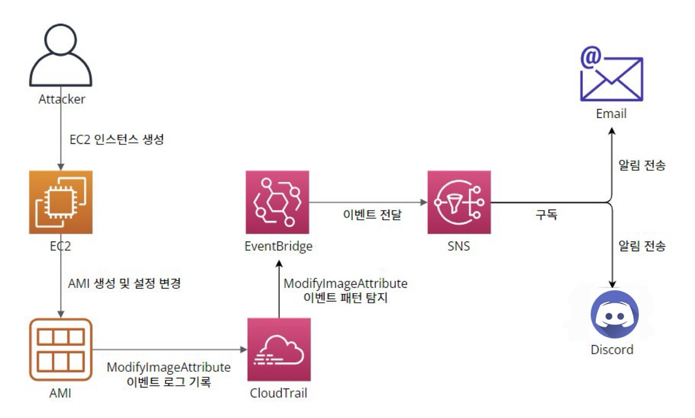
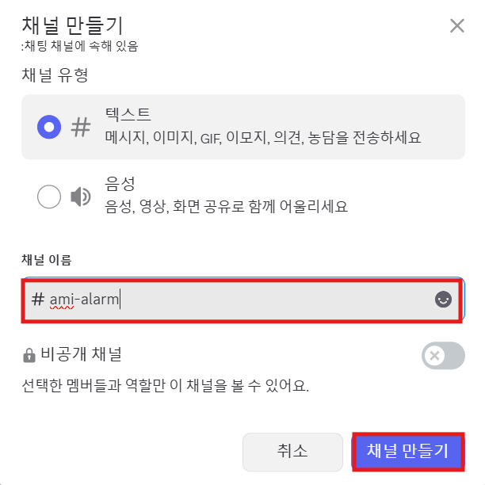
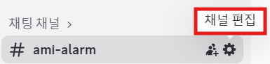
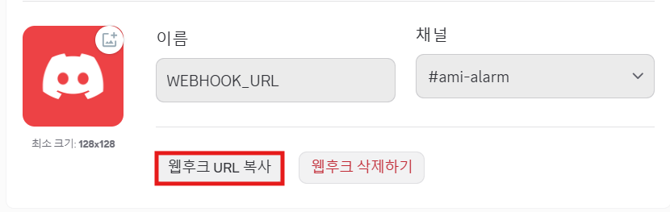
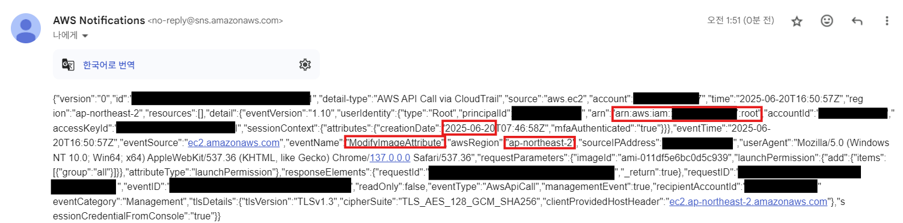
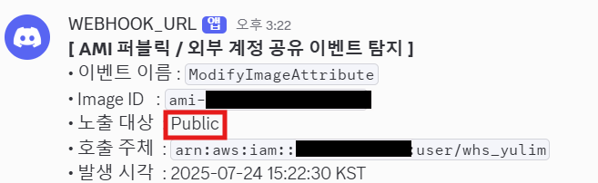
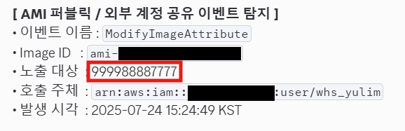

# 계정에 생성된 AMI 를 외부에 공개로 등록하거나 외부 계정에 공유하는 시도 탐지

## 계정에 생성된 AMI 를 외부에 공개로 등록하거나 외부 계정에 공유하는 시도 탐지

***

**\[ 목차 ]**

[#undefined](./#undefined "mention")

[#undefined-1](./#undefined-1 "mention")

[#undefined-2](./#undefined-2 "mention")

[#undefined-3](./#undefined-3 "mention")

[#undefined-4](./#undefined-4 "mention")

[#id-1.-cloudtrail](./#id-1.-cloudtrail "mention")

[#id-2.-lambda-discord](./#id-2.-lambda-discord "mention")

[#id-3.-sns](./#id-3.-sns "mention")

[#id-4.-eventbridge](./#id-4.-eventbridge "mention")

[#id-5](./#id-5 "mention")

***

### **\[ 시나리오 안내 ]**

| 내용     | 공격자가 내부 설정이 포함된 AMI를 외부에 퍼블릭 등록하거나 외부 계정에 공유하여 정보 유출 가능성이 있습니다.                                                                                                                               |
| ------ | --------------------------------------------------------------------------------------------------------------------------------------------------------------------------------------------- |
| 사용 서비스 | CloudTrail, EventBridge, SNS, EC2, AMI                                                                                                                                                        |
| 탐지 조건  | 1. AMI에 대해서 “ModifyImageAttribute”와 같은 이벤트가 발생한 경우 외부에 공개(퍼블릭)되거나 특정 계정으로 공유되는지 확인이 필요합니다.                                                                                                    |
|  탐지조건  | <p></p><ol><li>AMI에 대해서 “ModifyImageAttribute”와 같은 이벤트가 발생한 경우 외부에 공개(퍼블릭)되거나 특정 계정으로 공유되는지 확인이 필요합니다.</li><li>AMI 외부 공개시 발생하는 이벤트를 확인하고 상세 내용을 필터링하여 전체 공개 또는 특정계정으로의 공유여부를 검토합니다.</li></ol> |
| 알림 방식  | SNS + Email 및 Discord전송                                                                                                                                                                       |
| 대응     |                                                                                                                                                                                               |


#### 실습 개요

* 이 워크북에서는 Amazon EC2에서 생성한 AMI(Amazon Machine Image)가 외부에 퍼블릭으로 등록되거나 외부 계정에 공유되는 보안 위협을 탐지하는 방법을 학습합니다.
* AMI는 서버 설정, 애플리케이션, 보안 구성 등이 포함된 이미지로, 내부 시스템 구성 정보가 포함되어 있을 수 있어 외부 공개 시 심각한 보안 사고로 이어질 수 있습니다.
* 본 워크북에서는 AMI 속성이 변경되며 외부에 퍼블릭 등록되거나 특정 AWS 계정에 공유되는 이벤트를 실시간으로 감지하고, Email 및 Discord을 통해 알림을 전송하는 구성을 실습합니다.

#### 학습 목표

* CloudTrail을 활성화하고 EC2에서 발생하는 이미지 속성 변경 이벤트(ModifyImageAttribute 등)를 모니터링하는 방법을 학습합니다.
* AMI의 외부 공개(Public) 설정과 특정 계정 공유 설정의 차이를 이해할 수 있습니다.
* EventBridge 규칙을 생성하여 AMI 속성 변경 이벤트를 필터링하고, 이를 기반으로 경고를 발생시키는 방법을 익힙니다.
* Amazon SNS 토픽을 생성하고 이메일 또는 Slack을 구독자로 등록하여 알림을 전송하는 과정을 실습합니다.
* 실제 버킷을 생성하고 정책을 변경하여 구성한 탐지 정책이 동작하는지 검증하는 과정을 학습합니다.
* AMI를 생성하고 속성을 변경함으로써, 구성한 탐지 및 알림 시스템이 실제로 작동하는지 검증하는 방법을 학습합니다.

***

### \[ 시나리오 전체적인 흐름 ]

<figure><figcaption></figcaption></figure>

| **AWS Service** | **Service Purpose**                                                                                                                                                  | **Workbook Usage**                                                                                                 |
| --------------- | -------------------------------------------------------------------------------------------------------------------------------------------------------------------- | ------------------------------------------------------------------------------------------------------------------ |
| EC2 / AMI       | EC2는 AWS의 가상 서버 서비스이며, AMI(Amazon Machine Image)는 EC2 인스턴스를 생성하기 위한 템플릿으로 운영체제, 소프트웨어, 설정 정보 등을 포함합니다. AMI는 내부 시스템의 환경 구성이 담긴 민감 자산으로, 외부에 노출될 경우 보안 사고로 이어질 수 있습니다. | EC2 인스턴스로부터 AMI를 생성하고, 이를 외부에 퍼블릭 등록하거나 외부 AWS 계정에 공유하는 시도를 실습합니다. 실습 과정에서 해당 변경이 탐지되는지 확인합니다.                     |
| CloudTrail      | AWS 계정 내에서 발생하는 API 호출 및 이벤트를 기록하는 서비스입니다. 사용자가 수행한 모든 활동을 로그로 남겨 보안 분석, 문제 해결, 변경 추적 등에 활용됩니다.                                                                      | AMI 속성 변경(`ModifyImageAttribute`) 이벤트를 기록합니다. 이 이벤트는 AMI가 퍼블릭으로 설정되거나 외부 계정에 공유되는 경우 발생하며, 이를 기반으로 이후 탐지를 수행합니다.   |
| EventBridge     | AWS 서비스 및 애플리케이션에서 사용자가 정의한 이벤트가 발생하는 경우 다양한 대상 서비스(Discord, SNS 등)로 전달하는 서비스 입니다.복잡한 이벤트 버스를 구현하거나 스케쥴링 기능으로도 활용할 수 있습니다.                                           | CloudTrail로부터 전달된 `ModifyImageAttribute` 이벤트를 필터링하여, AMI의 외부 공개 또는 외부 계정 ID 공유 여부를 탐지하고, SNS 및 Lambda로 이벤트를 전달합니다. |
| SNS             | 발행-구독 기반의 메시징 서비스 입니다.이벤트를 HTTP, HTTPS, Email, SMS, Lambda, SQS 등 다양한 엔드포인트로 전달할 수 있습니다.                                                                             | EventBridge에서 전달된 탐지 이벤트를 수신하여, 사전 구독된 이메일 수신자에게 경고 메일을 전송합니다.                                                     |
| Lambda          | 서버를 프로비저닝하거나 관리할 필요 없이 코드를 실행할 수 있는 서버리스 컴퓨팅 서비스입니다.다양한 이벤트 소스(S3, Eventbridge, SNS 등)와 연동하여 이벤트에 대한 응답으로 코드를 실행할 수 있습니다.                                            | SNS로부터 전달된 AMI 탐지 이벤트를 받아, 메시지를 Discord로전송합니다.                                                                     |

***

#### 참고 사항

* 본 워크북에서 생성되는 리소스 중 일부는 Terraform code를 통해 제공되고 있습니다.
* 주요 리소스에 대한 사전 구성을 필요로 하는 경우 하단의 “xx. Terraform으로 리소스 구현” 에서 내용을 참고하실 수 있습니다.
* 본 서비스의 주요 리소스는 “ap-northeast-2(Seoul)”에서 리전에서 진행됩니다. 주요 서비스 및 기능은 제공되는 서비스 리전에 따라 다를 수 있습니다.

**\[ 콘솔 리소스명 ]**

| **리소스 종류**     | **리소스명 설정**                | **목적**                                       |
| -------------- | -------------------------- | -------------------------------------------- |
| CloudTrail     | `ami-monitor-trail`        | AMI 속성 변경 이벤트(ModifyImageAttribute)를 기록 및 추적 |
| Lambda 함수      | `lambda-ami-alarm`         | AMI 퍼블릭 등록 및 외부 계정 공유 시 Discord로 알림 전송       |
| SNS Topic      | `sns-alarm`                | 탐지 이벤트 발생 시 Email 및 Lambda로 알림 전송            |
| Discord 채널     | `ami-alarm`                | AMI 관련 탐지 알림 수신용 Discord 채널                  |
| EventBridge 규칙 | `ami-modifyimageattribute` | AMI의 launchPermission 변경 이벤트 탐지 및 SNS로 전달    |
| EC2 인스턴스       | `ami-detect`               | 테스트용 AMI 생성 및 퍼블릭/외부 계정 공유 시도 탐지             |

***

### **\[ 시나리오 상세 구현 과정 ]**

<details>

<summary>1. CloudTrail 추적 생성</summary>

**STEP 1) CloudTrail 검색**

<figure><figcaption></figcaption></figure>

AWS 계정 내에서 발생하는 API 호출 및 활동 내역을 자동으로 기록하고 추적하기 위해 **CloudTrail서비스**로 이동한다.

**STEP 2) CloudTrail 생성**

<figure><figcaption></figcaption></figure>

**Create trail** 버튼을 클릭해 사용할 추적을 생성한다.

**\[ 추적 속성 선택 ]**

<figure><figcaption></figcaption></figure>

CloudTrail 트레일(추적)의 기본 설정을 지정 후 **Next**버튼을 클릭한다.

* **Trail name** : **`ami-monitor-trail`**
* **Storage location :** Create new S3 bucket
*   **Additional settings**

    **Log file validation :** Enabled

    SNS notification delivery : **S3 버킷에 로그가 업로드 될 때마다 알림**을 SNS로 보내는 용도이므로 굳이 체크하지 않아도 된다.

**\[ 로그 이벤트 선택 ]**

<figure><figcaption></figcaption></figure>

로그 이벤트, 이벤트 관리 옵션 선택 후 **Next**버튼을 클릭한다.

* **Events** : Management events
* **Management events - API activity :** Read, Write

**\[** **검토 및 생성 ]**

<figure><figcaption></figcaption></figure>

각 단계 검토 후 **Create trail** 버튼을 클릭하면 추적이 생성된다.

**STEP 3) 추적 생성 확인**

<figure><figcaption></figcaption></figure>

대시보드에서 정상적으로 추적이 생성되었는지 확인한다.

</details>

<details>

<summary>2. Lambda 함수 생성 및 Discord 연동</summary>

**STEP 1) Discord 채널 생성 및 WebHook 설정**

**\[ 채널 만들기 ]**

<figure><figcaption></figcaption></figure>

이벤트에 관한 알림을 수신 할 채널을 만들어준다.

* **채널 이름** : **`ami-alarm`**

**\[ 채널 편집 ]**

<figure><figcaption></figcaption></figure>

위와 같이 생성된 채널에서 **채널 편집**을 클릭한다.

**\[ 웹후크 연동 ]**

<figure><figcaption></figcaption></figure>

왼쪽 상단의 설정 목록에서 **연동 → 웹후크 만들기**를 클릭하여 웹후크 봇을 만들어 준다.

**\[ 웹후크 URL 복사 ]**

<figure><figcaption></figcaption></figure>

**웹후크 URL 복사** 버튼을 클릭해 Lambda에서 사용할 URL을 복사한다.

* **이름** : WEBHOOK\_URL
* **채널** : **`#ami-alarm`** (앞서 생성한 채널 이름 선택)

**STEP 2) Lambda 함수 생성**

<figure><figcaption></figcaption></figure>

<figure><figcaption></figcaption></figure>

알람을 발송할 함수를 만들기 위해 AWS 콘솔에서 **Lambda서비스**로 이동한다.

Lambda 서비스 화면 오른쪽 상단의 **Create a function** 버튼을 클릭한다.

**\[ 함수 생성 ]**

<figure><figcaption></figcaption></figure>

함수 이름, 런타임 및 아키텍처를 지정하고 **Next**버튼을 클릭한다.

* **Author from scratch** 선택
* **Function name** : **`lambda-ami-alarm`**
* **Runtime** : Python 3.13
* **Architecture** : x86\_64

**\[ 생성된 함수 확인 ]**

<figure><figcaption></figcaption></figure>

정상적으로 Lambda함수가 생성되었는지 확인해준다.

**STEP 3) 환경 변수 편집**

<figure><figcaption></figcaption></figure>

이후 Configuration → Environment variables로 들어가서 **Edit** 버튼을 클릭한다.

**\[ 환경 변수 추가 ]**

<figure><figcaption></figcaption></figure>

Edit environment variables로 이동하여 **Add environment variables** 버튼을 클릭한다.

**\[ 환경 변수에 키와 값 추가 ]**

<figure><figcaption></figcaption></figure>

**Key, Value**를 \*\*\*\*다음과 같이 추가한 이후 **Save**버튼을 눌러 환경 변수를 추가해 준다.

* **Key, Value는 표를 참고**

| Key                   | **용도/설명**            | Value                                                                                           |
| --------------------- | -------------------- | ----------------------------------------------------------------------------------------------- |
| DISCORD\_WEBHOOK\_URL | 디스코드 알림용 Webhook URL | [https://discord.com/api/webhooks/\~\~\~](https://discord.com/api/webhooks/~~~) (알림 받을 웹후크 url) |

**STEP 4) Lambda 코드 소스 편집**

<figure><figcaption></figcaption></figure>

Code탭에서 **Lambda python 코드**를 작성 후 **Deploy**버튼을 클릭하여 배포해 준다.

```python
#----------------------------------------------------------------------------
# 필요한 라이브러리 임포트
#----------------------------------------------------------------------------

import json                                  # SNS 메시지(JSON 문자열)를 파싱하기 위해 사용
import urllib3                               # Discord Webhook으로 HTTP POST 요청을 보내기 위해 사용
import os                                    # Lambda 환경 변수를 읽기 위해 사용
from datetime import datetime, timezone, timedelta   # UTC 시각을 한국 표준시(KST)로 변환하기 위해 사용

#----------------------------------------------------------------------------
# 환경 변수 및 기본 설정
#----------------------------------------------------------------------------

# Discord Webhook URL을 Lambda 환경 변수에서 읽어옴
WEBHOOK_URL = os.environ["DISCORD_WEBHOOK_URL"]

# HTTP 연결을 재사용하기 위한 urllib3 커넥션 풀 생성
http = urllib3.PoolManager()

# 한국 표준시(KST, UTC+9) 타임존 객체 생성
KST = timezone(timedelta(hours=9), "KST")

#----------------------------------------------------------------------------
# Lambda 핸들러 정의
#----------------------------------------------------------------------------

def lambda_handler(event, context):
    """
    EventBridge → SNS → Lambda 구조에서 SNS 메시지를 파싱하여
    AMI 퍼블릭 또는 외부 계정 공유 이벤트를 탐지하고 Discord로 전송하는 함수
    """
    try:
        # SNS 메시지는 event["Records"][0]["Sns"]["Message"] 위치에 문자열로 저장됨
        sns_payload = event["Records"][0]["Sns"]["Message"]

        # 문자열이면 JSON 파싱, 아니면 그대로 사용
        ct_event = json.loads(sns_payload) if isinstance(sns_payload, str) else sns_payload

        # CloudTrail 이벤트 상세 정보 추출
        detail = ct_event.get("detail", {})

        # 이벤트 이름이 "ModifyImageAttribute"가 아니면 무시하고 종료
        if detail.get("eventName") != "ModifyImageAttribute":
            return

        #----------------------------------------------------------------------------
        # 이벤트 필드 추출
        #----------------------------------------------------------------------------

        # 이벤트 이름 (예: ModifyImageAttribute)
        event_name = detail.get("eventName", "Unknown")

        # 변경 대상 AMI 이미지 ID
        image_id = detail.get("requestParameters", {}).get("imageId", "Unknown")

        # 호출한 사용자(주체)의 ARN 정보
        user_arn = detail.get("userIdentity", {}).get("arn", "N/A")

        # 이벤트 발생 시각 (UTC ISO 포맷 문자열)
        utc_iso = ct_event.get("time")

        # UTC 시각을 KST(한국 시간)으로 변환하여 문자열로 저장
        if utc_iso:
            utc_dt = datetime.fromisoformat(utc_iso.replace("Z", "+00:00"))  # ISO 포맷 파싱
            kst_time = utc_dt.astimezone(KST).strftime("%Y-%m-%d %H:%M:%S KST")  # KST 문자열로 변환
        else:
            kst_time = "Unknown"

        #----------------------------------------------------------------------------
        # 퍼블릭 공개 또는 외부 계정 공유 여부 확인
        #----------------------------------------------------------------------------

        # launchPermission → add → items 배열 확인
        items = (detail.get("requestParameters", {})
                         .get("launchPermission", {})
                         .get("add", {})
                         .get("items", []))

        # 노출 대상 수집용 리스트
        exposure = []

        # 그룹이 "all"인 경우 → 퍼블릭 공개
        if any(it.get("group") == "all" for it in items):
            exposure.append("Public")

        # userId가 있는 경우 → 외부 계정 공유
        exposure += [it["userId"] for it in items if "userId" in it]

        # 노출 대상이 없으면 Unknown으로 설정
        exposure_str = ", ".join(exposure) if exposure else "Unknown"

        #----------------------------------------------------------------------------
        # Discord 메시지 구성
        #----------------------------------------------------------------------------

        message = (
            "**[ AMI 퍼블릭 / 외부 계정 공유 이벤트 탐지 ]**\n"
            f"• 이벤트 이름 : `{event_name}`\n"
            f"• Image ID   : `{image_id}`\n"
            f"• 노출 대상  : {exposure_str}\n"
            f"• 호출 주체  : `{user_arn}`\n"
            f"• 발생 시각  : {kst_time}"
        )

        #----------------------------------------------------------------------------
        # Discord Webhook POST 요청 전송
        #----------------------------------------------------------------------------

        response = http.request(
            "POST",
            WEBHOOK_URL,  # Discord Webhook URL
            headers={
                "Content-Type": "application/json",      # JSON 형식으로 전송
                "User-Agent": "aws-lambda-discord/1.0"   # 일부 보안 필터 통과를 위한 User-Agent 지정
            },
            body=json.dumps({"content": message})        # 메시지 본문
        )

        # 성공적으로 전송된 경우 HTTP 상태코드와 응답 본문 반환
        return {
            "statusCode": response.status,               # 204 (No Content) 예상
            "body": response.data.decode("utf-8")
        }

    except Exception as exc:
        # 예외 발생 시 로그 출력 후 Lambda 함수 실패 처리
        print("Error:", exc)
        raise

```

</details>

<details>

<summary>3. SNS 주제 생성 및 구독 생성</summary>

**STEP 1) SNS 검색**

<figure><figcaption></figcaption></figure>

알람을 전송 받을 주제 및 구독을 생성하기 위해 **SNS 서비스**로 이동한다.

**STEP 2) 주제 생성**

<figure><figcaption></figcaption></figure>

<figure><figcaption></figcaption></figure>

좌측 탭에서 Topic으로 이동 후 **Create topic** 버튼을 클릭한다.

* **Type** : Standard
* **Name** : **`sns-alarm`**

**STEP 3-1 ) 구독 생성 - Email**

<figure><figcaption></figcaption></figure>


생성된 주제 확인 후 **Create subscription**을 누른다.

**\[ 구독 생성 - 세부사항 ]**

<figure><figcaption></figcaption></figure>

* **Protocol** : Email
* **Endpoint** : 알람 받을 이메일 주소

**STEP 3-2 ) 구독 생성 - Lambda**

<figure><figcaption></figcaption></figure>

생성된 주제 확인 후 **Create subscription**을 누른다.

**\[ 구독 생성 - 세부사항 ]**

<figure><figcaption></figcaption></figure>

* **Protocol** : AWS Lambda
* **Endpoint** : 생성한 lambda function 선택

**STEP 4) 구독한 이메일 인증**

<figure><figcaption></figcaption></figure>

<figure><figcaption></figcaption></figure>

설정한 이메일 주소로 SNS의 Subscription Confirmation 메일이 전송된다. 이메일을 열어 **Confirm subscription** 버튼을 클릭해야 알림 수신이 정상적으로 설정된다.

**Confirm subscription**를 눌러 인증을 완료하면, SNS 구독이 정상적으로 등록된 것이다.

**STEP 5) 트리거된 lambda 확인**

<figure><figcaption></figcaption></figure>

Lambda에서 생성한 function을 확인해보면, 트리거가 된 것을 확인할 수 있다. 이렇게 되면 설정이 완료된 것이다.

</details>

<details>

<summary>4. EventBridge 규칙 생성</summary>

**STEP 1) EventBridge 검색**

<figure><figcaption></figcaption></figure>

Lambda 함수를 주기적으로 실행하기 위해 AWS 콘솔에서 **EventBridge 서비스**로 이동한다.

**STEP 2) EventBridge 규칙 생성**

<figure><figcaption></figcaption></figure>

**Create rule** 버튼을 클릭해서 새 EventBridge 규칙을 생성한다.

**\[ 규칙 세부 정보 정의 ]**

<figure><figcaption></figcaption></figure>

* **Name** : **`ami-modifyimageattribute`**
* **Description**: (옵션)
* **Event bus**: default
* **Rule type** : Rule with an event pattern

**\[ 이벤트 패턴 작성 ]**

<figure><figcaption></figcaption></figure>

* **Events :** Other
*   **Event pattern :** Custom pattern(JSON editor)

    사용자가 원하는 조건만 감지할 수 있도록 JSON으로 직접 작성
*   AMI가 퍼블릭 공개 또는 특정 외부 계정에 공유된 시도의 **이벤트를 탐지**하는 역할 JSON 코드

    ```json
    {
      "source": ["aws.ec2"],
      "detail-type": ["AWS API Call via CloudTrail"],
      "detail": {
        "eventName": ["ModifyImageAttribute"],
        "requestParameters": {
          "attributeType": ["launchPermission"]
        }
      }
    }
    ```

**\[ 대상 선택 ]**

<figure><figcaption></figcaption></figure>

이벤트가 감지되었을 때 실행할 대상 지정하고 **Next**버튼을 클릭한다.

* **Target types** : AWS service
* **Select a target** : SNS topic
* **Target location** : Target in this account
* **Topic** : 미리 만들어 둔 sns topic 선택
* **Execution role** : Create a new role for this specific resource
* **Role name** : 자동 할당

**\[ 태그 구성 (선택) ]**

<figure><figcaption></figcaption></figure>

태그 구성은 선택 사항이므로 **Next**버튼을 클릭한다.

**\[ 검토 및 생성 ]**

<figure><figcaption></figcaption></figure>

설정 내용 최종 확인 후 **Create rule**버튼을 클릭한다.

* status - **enabled** 확인

**STEP 3) 생성된 규칙 확인**

<figure><figcaption></figcaption></figure>

규칙이 정상적으로 생성되었는지 확인해준다.

</details>

<details>

<summary>5. 테스트</summary>

> 실제로 AMI를 퍼블릭 공개 또는 특정 외부 계정에 공유 시도를 해보고, 알림이 작동하는지 이벤트발생을 확인한다.

**\[ 탐지 이벤트 안내 ]**

| **이벤트 이름**                          | **설명**                    | **탐지 목적**                                      |
| ----------------------------------- | ------------------------- | ---------------------------------------------- |
| `ModifyImageAttribute`노출 대상: Public | AMI가 **퍼블릭**으로 설정된 경우     | AMI가 외부에 공개되어 **내부 구성 정보 유출** 가능성을 탐지          |
| `ModifyImageAttribute`노출 대상: 외부 계정  | AMI가 **특정 외부 계정**에 공유된 경우 | 신뢰되지 않은 외부 계정에 AMI가 전달되어 **보안 사고로 이어질 가능성** 탐지 |

**STEP 1) EC2 인스턴스 생성**

<figure><figcaption></figcaption></figure>

인스턴스를 생성하기 위해 EC2 서비스로 이동한다.

<figure><figcaption></figcaption></figure>

사용할 EC2 인스턴스를 **Launch instances** 클릭해 시작한다.

**\[ 인스턴스 생성 ]**

<figure><figcaption></figcaption></figure>

* Name : **`ami-detect`**

나머지는 default 값으로 진행하며, **Launch instance**을 클릭해 인스턴스를 실행한다.

**\[ Key Pair 생성 ]**

<figure><figcaption></figcaption></figure>

* Create new key pair
* **Key pair name: `ami-detect`**
* **Key pair type :** RSA
* **Private key file format :** .pem

ec2 인스턴스에 안전하고 효율적으로 접근하기 위해 설정하는 것이다. 설정을 완료하면 launch instance를 클릭하면 된다.

**\[ 인스턴스 생성 확인 ]**

<figure><figcaption></figcaption></figure>

인스턴스가 생성된 것을 확인할 수 있다.

**STEP 2) 탐지할 AMI 생성**

<figure><figcaption></figcaption></figure>

생성된 인스턴스의 **Actions**에서 **Image and templates** 클릭 후, **Create image**를 \*\*\*\*선택하면 된다.

**\[ AMI 생성 ]**

<figure><figcaption></figcaption></figure>

* **Image name** : **`ami-detect`**

나머지는 default로 설정하고 이미지를 생성한다.

**\[ AMI 생성 확인 ]**

<figure><figcaption></figcaption></figure>

EC2에서 AMIs를 클릭하면, 생성된 이미지를 확인할 수 있다.

**\[ `ModifyImageAttribute` Public 탐지 이벤트 발생 ]**

<figure><figcaption></figcaption></figure>

EC2 Dashboard에서 Account attributes 부분에 **Data protection and security**를 클릭한다.

<figure><figcaption></figcaption></figure>

AMI에 대한 Block public access for AMIs 에서 **Manage**를 클릭한다.

<figure><figcaption></figcaption></figure>

Block new public sharing(신규 공개 공유 차단)을 해제하고 **Update**를 클릭한다.

EC2 AMI는 기본적으로 Private이고, 퍼블릭으로 바꾸는 설정은 EC2 인스턴스 대시보드에서 설정을 먼저 변경해주어야 AMI에서 퍼블릭 설정을 할 수 있다. 그 이유는, **AWS의 보안 기본 정책**과 **의도하지 않은 정보 유출 방지를 위한 안전장치**이기 때문이다.

<figure><figcaption></figcaption></figure>

EC2 AMIs에서 Permission을 클릭한 후, **Edit AMI permissions**을 클릭한다.

<figure><figcaption></figcaption></figure>

AMI availability를 Private에서 Public으로 변경하고, **Save changes**을 클릭하면 알림이 오는 것을 확인할 수 있다.

**\[ `ModifyImageAttribute` 외부 계정 공유 시도 탐지 이벤트 발생 ]**

<figure><figcaption></figcaption></figure>

EC2 AMIs에서 **Add account ID**를 클릭한다.

**\[ 외부 계정 ID 추가 ]**

<figure><figcaption></figcaption></figure>

계정 ID의 경우, 12개의 숫자로 이루어져 있기 때문에, 12개의 랜덤 수를 작성해준다. 그리고 **Share AMI**를 클릭한다.

**\[ 변경사항 저장 ]**

<figure><figcaption></figcaption></figure>

**Save changes**을 클릭하면 알림이 오는 것을 확인할 수 있다.

***

**\[ Email 알림 확인 ]**

<figure><figcaption></figcaption></figure>

**\[ Discord 알림 확인 ]**

**\[Ami Public]**

<figure><figcaption></figcaption></figure>

**\[AMI 외부 계정 공유]**

<figure><figcaption></figcaption></figure>

</details>

