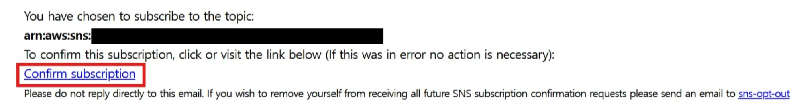

# Terraform

> **IaC를 사용하는 이유**
>
> ***
>
> 수동 설정은 실수 위험이 크고 반복이 어렵지만, Terraform을 사용하면 콘솔에서 구현한 시나리오를 코드로 재현할 수 있어 **버전 관리, 재사용, 자동화**에 유리하다.

**참고**

실습 전 [IaC 실습 전 환경 구성](https://www.notion.so/IaC-236b5a2aa9af80528203d0ee4c07992d?pvs=21) 을 참고하여 환경 구성을 완료했다면 Terraform 코드를 실행하여 리소스를 자동으로 생성할 수 있다.

**\[ terraform 파일 구조 ]**

```hcl
Terraform-code/
├── main.tf                 # 모든 주요 Terraform 리소스 정의
├── variables.tf            # 입력 변수 정의 (Email, Discord Webhook 등)
├── terraform.tfvars        # 민감 데이터 정의 (Email, Webhook URL 등)
└── lambda_function.zip              # 디스코드 알림을 전송하는 패키지된 Lambda 코드
│   └── lambda_function.py  # Lambda 함수 원본 코드
```

<details>

<summary>1. main.tf</summary>

````c
```hcl
# main.tf

#----------------------------------------------------------------------------
# Provider 설정 (서울 리전)
#----------------------------------------------------------------------------
provider "aws" {
  region = "ap-northeast-2" # AWS 서울 리전 사용
}

# 현재 계정 정보 (Account ID 등)를 참조하기 위해 사용
data "aws_caller_identity" "current" {}

#----------------------------------------------------------------------------
# 1. S3 + CloudTrail 로그 저장 설정
#----------------------------------------------------------------------------

# CloudTrail 로그를 저장할 S3 버킷 생성
resource "aws_s3_bucket" "trail_bucket" {
  bucket        = "ami-monitoring-trail-bucket" # 고유한 버킷 이름 사용
  force_destroy = true # 버킷 삭제 시 객체도 함께 삭제
}

# S3 버킷에 대한 퍼블릭 접근 차단 설정
resource "aws_s3_bucket_public_access_block" "trail_bucket_block" {
  bucket = aws_s3_bucket.trail_bucket.id

  block_public_acls       = true  # 퍼블릭 ACL 지정 차단
  block_public_policy     = true  # 퍼블릭한 버킷 정책 차단
  ignore_public_acls      = true  # 퍼블릭 ACL 있어도 무시
  restrict_public_buckets = true  # 퍼블릭 정책이 있어도 접근 거부
}

# CloudTrail이 S3에 로그를 쓸 수 있도록 정책 부여
resource "aws_s3_bucket_policy" "trail_bucket_policy" {
  bucket = aws_s3_bucket.trail_bucket.id

  policy = jsonencode({
    Version = "2012-10-17",
    Statement = [
      {
        Sid: "AWSCloudTrailAclCheck",
        Effect: "Allow",
        Principal: {
          Service: "cloudtrail.amazonaws.com"
        },
        Action: "s3:GetBucketAcl",
        Resource: "arn:aws:s3:::${aws_s3_bucket.trail_bucket.id}"
      },
      {
        Sid: "AWSCloudTrailWrite",
        Effect: "Allow",
        Principal: {
          Service: "cloudtrail.amazonaws.com"
        },
        Action: "s3:PutObject",
        Resource: "arn:aws:s3:::${aws_s3_bucket.trail_bucket.id}/AWSLogs/${data.aws_caller_identity.current.account_id}/*",
        Condition: {
          StringEquals: {
            "s3:x-amz-acl": "bucket-owner-full-control"
          }
        }
      }
    ]
  })
}

# CloudTrail 생성 (전 리전 로그 수집)
resource "aws_cloudtrail" "ami_trail" {
  name                          = "ami-monitoring-trail" # 트레일 이름
  s3_bucket_name                = aws_s3_bucket.trail_bucket.id # 로그 저장 버킷
  include_global_service_events = true  # IAM 등 글로벌 서비스 포함
  is_multi_region_trail         = true  # 모든 리전 이벤트 포함
  enable_logging                = true  # 로그 수집 활성화

  depends_on = [aws_s3_bucket_policy.trail_bucket_policy]
}

#----------------------------------------------------------------------------
# 2. Lambda 함수 (Discord Webhook 알림)
#----------------------------------------------------------------------------

# Lambda 실행 권한을 부여할 IAM Role 생성
resource "aws_iam_role" "lambda_exec_role" {
  name = "ami_alert_lambda_role"

  assume_role_policy = jsonencode({
    Version: "2012-10-17",
    Statement: [{
      Effect: "Allow",
      Action: "sts:AssumeRole",
      Principal: {
        Service: "lambda.amazonaws.com"
      }
    }]
  })
}

# Lambda에 CloudWatch 로그 기록 정책 부여
resource "aws_iam_role_policy_attachment" "lambda_basic" {
  role       = aws_iam_role.lambda_exec_role.name
  policy_arn = "arn:aws:iam::aws:policy/service-role/AWSLambdaBasicExecutionRole"
}

# Discord Webhook으로 알림을 보내는 Lambda 함수 생성
resource "aws_lambda_function" "discord_alert" {
  filename         = "lambda.zip" # 패키징된 Lambda 코드(zip 파일)
  function_name    = "ami_alert" # 함수 이름
  role             = aws_iam_role.lambda_exec_role.arn
  handler          = "lambda_function.lambda_handler" # Python 핸들러
  runtime          = "python3.12" # 실행 런타임
  source_code_hash = filebase64sha256("lambda.zip") # 코드 무결성 확인

  environment {
    variables = {
      HOOK_URL = var.discord_webhook_url # Discord Webhook URL 환경 변수
    }
  }
}

#----------------------------------------------------------------------------
# 3. SNS Topic (Email + Lambda 알림 전송)
#----------------------------------------------------------------------------

# SNS 주제 생성
resource "aws_sns_topic" "ami_topic" {
  name = "ami-change-topic"
}

# 이메일 구독자 등록 (알림 수신)
resource "aws_sns_topic_subscription" "email_sub" {
  topic_arn = aws_sns_topic.ami_topic.arn
  protocol  = "email"
  endpoint  = var.notification_email
}

# Lambda 함수 구독 등록 (알림 수신)
resource "aws_sns_topic_subscription" "lambda_sub" {
  topic_arn = aws_sns_topic.ami_topic.arn
  protocol  = "lambda"
  endpoint  = aws_lambda_function.discord_alert.arn
}

# SNS가 Lambda 함수를 호출할 수 있도록 권한 허용
resource "aws_lambda_permission" "allow_sns" {
  statement_id  = "AllowExecutionFromSNS"
  action        = "lambda:InvokeFunction"
  function_name = aws_lambda_function.discord_alert.function_name
  principal     = "sns.amazonaws.com"
  source_arn    = aws_sns_topic.ami_topic.arn
}

# EventBridge가 SNS로 메시지 전송할 수 있도록 정책 설정
resource "aws_sns_topic_policy" "allow_eventbridge" {
  arn = aws_sns_topic.ami_topic.arn

  policy = jsonencode({
    Version: "2012-10-17",
    Statement: [{
      Sid: "AllowEventBridgePublish",
      Effect: "Allow",
      Principal: {
        Service: "events.amazonaws.com"
      },
      Action: "sns:Publish",
      Resource: aws_sns_topic.ami_topic.arn
    }]
  })
}

#----------------------------------------------------------------------------
# 4. EventBridge 규칙 (AMI launchPermission 변경 탐지)
#----------------------------------------------------------------------------

# AMI launchPermission 속성 변경 이벤트 탐지
resource "aws_cloudwatch_event_rule" "ami_attribute_change" {
  name        = "detect-ami-launch-permission-change"
  description = "Detect when AMI launchPermission is modified (public or shared)"

  event_pattern = jsonencode({
    "source": ["aws.ec2"], # EC2 서비스로부터 발생한 이벤트
    "detail-type": ["AWS API Call via CloudTrail"], # CloudTrail API 이벤트
    "detail": {
      "eventName": ["ModifyImageAttribute"], # AMI 속성 변경 이벤트
      "requestParameters": {
        "attributeType": ["launchPermission"] # launchPermission이 변경된 경우만
      }
    }
  })
}

# 탐지된 이벤트를 SNS로 전달
resource "aws_cloudwatch_event_target" "ami_to_sns" {
  rule      = aws_cloudwatch_event_rule.ami_attribute_change.name
  target_id = "SendToSNS"
  arn       = aws_sns_topic.ami_topic.arn
}

```
````

</details>

<details>

<summary>2. variables.tf</summary>

````c
```hcl
# variables.tf
# Discord Webhook URL을 저장할 변수
# 이 URL은 Lambda 함수의 환경변수로 전달되어 알림 전송에 사용됨
variable "discord_webhook_url" {
  description = "Discord Webhook URL for Lambda environment variable"
  type        = string
  sensitive   = true  # 터미널 출력이나 로그에 표시되지 않도록 민감 정보로 처리
}

# SNS 이메일 구독자 주소를 저장할 변수
# 이 주소로 AMI 변경 탐지 시 이메일 알림이 전송됨
variable "notification_email" {
  description = "Email address to subscribe to SNS topic"
  type        = string
}
``
````

</details>

<details>

<summary>3. terraform.tfvars</summary>

````c
```hcl
# terraform.tfvars
# Discord Webhook URL 입력
# 해당 URL은 Discord에서 생성된 Webhook 주소로, 메시지 전송에 사용됨
discord_webhook_url = ""

# SNS 이메일 수신자 주소 입력
# 실제 수신할 이메일 주소를 여기에 입력해야 SNS 알림이 전송됨
# 현재 비어 있으므로 사용 전 반드시 유효한 이메일 주소로 설정해야 함
notification_email  = ""

````

</details>

<details>

<summary>4. lambda.zip (lambda_function.py)</summary>

````c
**의존성 없이 zip 만들기**

```bash
zip lambda.zip lambda_function.py
```

> **Lambda는 함수 코드를 압축한 `.zip` 파일만 인식하고 실행할 수 있도록 설계되어 있기 때문**이다.
> 
> 
> Terraform이나 AWS CLI, 콘솔에서 Lambda 코드를 업로드할 때 `.zip`은 사실상 **표준 형식**이다.
> 

```python
# lambda_function.zip 안에 있는 lambda_function.py
#----------------------------------------------------------------------------
# 필요한 라이브러리 임포트
#----------------------------------------------------------------------------

import json                                  # SNS 메시지(JSON 문자열)를 파싱하기 위해 사용
import urllib3                               # Discord Webhook으로 HTTP POST 요청을 보내기 위해 사용
import os                                    # Lambda 환경 변수를 읽기 위해 사용
from datetime import datetime, timezone, timedelta   # UTC 시각을 한국 표준시(KST)로 변환하기 위해 사용

#----------------------------------------------------------------------------
# 환경 변수 및 기본 설정
#----------------------------------------------------------------------------

# Discord Webhook URL을 Lambda 환경 변수에서 읽어옴
WEBHOOK_URL = os.environ["DISCORD_WEBHOOK_URL"]

# HTTP 연결을 재사용하기 위한 urllib3 커넥션 풀 생성
http = urllib3.PoolManager()

# 한국 표준시(KST, UTC+9) 타임존 객체 생성
KST = timezone(timedelta(hours=9), "KST")

#----------------------------------------------------------------------------
# Lambda 핸들러 정의
#----------------------------------------------------------------------------

def lambda_handler(event, context):
    """
    EventBridge → SNS → Lambda 구조에서 SNS 메시지를 파싱하여
    AMI 퍼블릭 또는 외부 계정 공유 이벤트를 탐지하고 Discord로 전송하는 함수
    """
    try:
        # SNS 메시지는 event["Records"][0]["Sns"]["Message"] 위치에 문자열로 저장됨
        sns_payload = event["Records"][0]["Sns"]["Message"]

        # 문자열이면 JSON 파싱, 아니면 그대로 사용
        ct_event = json.loads(sns_payload) if isinstance(sns_payload, str) else sns_payload

        # CloudTrail 이벤트 상세 정보 추출
        detail = ct_event.get("detail", {})

        # 이벤트 이름이 "ModifyImageAttribute"가 아니면 무시하고 종료
        if detail.get("eventName") != "ModifyImageAttribute":
            return

        #----------------------------------------------------------------------------
        # 이벤트 필드 추출
        #----------------------------------------------------------------------------

        # 이벤트 이름 (예: ModifyImageAttribute)
        event_name = detail.get("eventName", "Unknown")

        # 변경 대상 AMI 이미지 ID
        image_id = detail.get("requestParameters", {}).get("imageId", "Unknown")

        # 호출한 사용자(주체)의 ARN 정보
        user_arn = detail.get("userIdentity", {}).get("arn", "N/A")

        # 이벤트 발생 시각 (UTC ISO 포맷 문자열)
        utc_iso = ct_event.get("time")

        # UTC 시각을 KST(한국 시간)으로 변환하여 문자열로 저장
        if utc_iso:
            utc_dt = datetime.fromisoformat(utc_iso.replace("Z", "+00:00"))  # ISO 포맷 파싱
            kst_time = utc_dt.astimezone(KST).strftime("%Y-%m-%d %H:%M:%S KST")  # KST 문자열로 변환
        else:
            kst_time = "Unknown"

        #----------------------------------------------------------------------------
        # 퍼블릭 공개 또는 외부 계정 공유 여부 확인
        #----------------------------------------------------------------------------

        # launchPermission → add → items 배열 확인
        items = (detail.get("requestParameters", {})
                         .get("launchPermission", {})
                         .get("add", {})
                         .get("items", []))

        # 노출 대상 수집용 리스트
        exposure = []

        # 그룹이 "all"인 경우 → 퍼블릭 공개
        if any(it.get("group") == "all" for it in items):
            exposure.append("Public")

        # userId가 있는 경우 → 외부 계정 공유
        exposure += [it["userId"] for it in items if "userId" in it]

        # 노출 대상이 없으면 Unknown으로 설정
        exposure_str = ", ".join(exposure) if exposure else "Unknown"

        #----------------------------------------------------------------------------
        # Discord 메시지 구성
        #----------------------------------------------------------------------------

        message = (
            "**[ AMI 퍼블릭 / 외부 계정 공유 이벤트 탐지 ]**\n"
            f"• 이벤트 이름 : `{event_name}`\n"
            f"• Image ID   : `{image_id}`\n"
            f"• 노출 대상  : {exposure_str}\n"
            f"• 호출 주체  : `{user_arn}`\n"
            f"• 발생 시각  : {kst_time}"
        )

        #----------------------------------------------------------------------------
        # Discord Webhook POST 요청 전송
        #----------------------------------------------------------------------------

        response = http.request(
            "POST",
            WEBHOOK_URL,  # Discord Webhook URL
            headers={
                "Content-Type": "application/json",      # JSON 형식으로 전송
                "User-Agent": "aws-lambda-discord/1.0"   # 일부 보안 필터 통과를 위한 User-Agent 지정
            },
            body=json.dumps({"content": message})        # 메시지 본문
        )

        # 성공적으로 전송된 경우 HTTP 상태코드와 응답 본문 반환
        return {
            "statusCode": response.status,               # 204 (No Content) 예상
            "body": response.data.decode("utf-8")
        }

    except Exception as exc:
        # 예외 발생 시 로그 출력 후 Lambda 함수 실패 처리
        print("Error:", exc)
        raise

```
````

</details>

<details>

<summary>5. 코드 실행</summary>

**\[ Terraform 실행 코드 ]**

```
terraform init # 초기화
terraform plan # 설정 검증
terraform apply # 적용 (실행)
-------------------------------------------------------
terraform destroy # 실습 완료 후, 리소스 정리
```

**\[ init ]**

```
terraform init
```

Terraform 프로젝트를 처음 시작할 때 실행하는 명령어로, 작업 디렉토리를 초기화하고 필요한 설정 파일과 실행에 필요한 구성 요소들을 준비해준다. 이후 plan, apply 등의 명령을 정상적으로 사용할 수 있는 상태로 만든다.

```
Terraform has been successfully initialized!

You may now begin working with Terraform. Try running "terraform plan" to see
any changes that are required for your infrastructure. All Terraform commands
should now work.

If you ever set or change modules or backend configuration for Terraform,
rerun this command to reinitialize your working directory. If you forget, other
commands will detect it and remind you to do so if necessary.
```

위와 같은 메시지가 출력되면, 프로젝트가 초기화되어 Terraform 명령어를 사용할 수 있는 준비가 완료된 것이다.


**\[ plan ]**

```
terraform plan
```

Terraform 코드 적용 시, 인프라에 어떤 변경이 발생할지 미리 확인할 수 있는 실행 계획을 보여주는 명령어이다.

```
Plan: 14 to add, 0 to change, 0 to destroy.
```

총 14개의 리소스가 새로 생성될 예정이며, 실행 계획이 정상적으로 생성된 상태이다. 이 출력 결과는 적용해도 문제가 없는 준비 완료 상태임을 의미한다.


**\[ apply ]**

```
terraform apply
```

terraform apply 명령어는 실행 계획(plan)에 따라 실제로 클라우드 인프라를 생성, 변경, 삭제하는 작업을 수행한다. Plan 단계에서 검토한 내용을 기반으로 실제 인프라에 반영하고자 할 때 사용한다.

```bash
Apply complete! Resources: 14 added, 0 changed, 0 destroyed.
```

위와 같은 메시지가 출력되면, 모든 리소스가 정상적으로 생성되었거나 업데이트되어 인프라 상태가 원하는 대로 적용된 것이다.

**\[ 이메일 인증 ]**

<figure><figcaption></figcaption></figure>

terraform apply 이후, 설정한 이메일 주소로 SNS의 Subscription Confirmation 메일이 전송된다. 이메일을 열어 **Confirm subscription** 버튼을 클릭해야 알림 수신이 정상적으로 설정된다.

<figure><figcaption></figcaption></figure>

**Confirm subscription**를 눌러 인증을 완료하면, SNS 구독이 정상적으로 등록된 것이다.


[5. 테스트](https://www.notion.so/5-213b5a2aa9af80ff9501c4b631238d9b?pvs=21)

인증 후 위를 참고하여 테스트를 진행하면 된다.


**\[ destroy ]**

```
terraform destroy
```

Terraform으로 생성된 모든 인프라 리소스를 자동으로 삭제하는 명령어이다. **실습 완료 후**에는 해당 명령어로 불필요한 리소스를 정리할 수 있다.

```bash
Destroy complete! Resources: 14 destroyed.
```

위와 같은 메시지가 출력되면, 모든 리소스가 성공적으로 정리되었음을 의미한다.

</details>

**\[ 전체 코드 압축 파일 ]**


